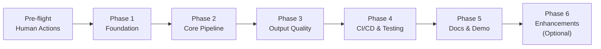

# PAI Take-Home Exercise — Plan of Plans

**Engagement:** eng-2026-003 — PAI Packaging Automation PoC (Adobe interview take-home)
**SA Deliverables:** `outputs/eng-2026-003/` in `C:\dev\solutions-architecture-agent`
**Exercise Spec:** `inputs/PAI-Take_Home_Exercise.md`
**Target Repo:** `C:\dev\pai-take-home-exercise` → `github.com/praeducer/pai-take-home-exercise`
**Architecture Version:** 2.0 (2026-03-18)

---

## Global Acceptance Criteria

The exercise is complete when ALL of the following are true:

- [ ] GitHub repo `praeducer/pai-take-home-exercise` is public
- [ ] Pipeline accepts SKU brief JSON and produces images in 3 aspect ratios (1:1, 9:16, 16:9)
- [ ] At least 2 products/flavors per run
- [ ] S3 organized by `{SKU}/{Region}/{format}/` (front_label, back_label, wraparound)
- [ ] CloudFormation deploys all AWS resources (S3 × 2, IAM role, Budget alarm)
- [ ] GitHub Actions CI/CD passes on main (ci.yml lint+test+pip-audit, deploy.yml CF update)
- [ ] README: how-to-run, example I/O with image embeds, design decisions, assumptions/limitations, backlog
- [ ] Claude Code skills provide all interface operations (8 skills in `.claude/skills/`)
- [ ] Demo-ready: full pipeline run completes in under 60 seconds (dev tier)
- [ ] `git tag v1.0.0` pushed to origin

---

## Phase Dependency Graph

**Critical path:** AWS console Bedrock access (G-001, BLOCKING) → first image (G-002) → all 3 ratios (G-003) → CI/CD green (G-004) → repo published (G-005)

**P6 is optional.** P5 completion = all exercise requirements met. P6 adds brand compliance and regulatory checks as bonus differentiation.

---

## Decision Gates

| Gate | After Phase | Blocking | Human Action Required |
|------|------------|----------|----------------------|
| G-001 | Pre-P1 | YES | Enable Bedrock model access in AWS console |
| G-002 | P-002 | YES | Visual inspection of first generated images |
| G-003 | P-003 | YES | Visual inspection of all 3 aspect ratios |
| G-004 | P-004 | YES | Verify GitHub Actions green checkmarks |
| G-005 | P-005 | No | Final review before interview submission |

---

## Human Action List (Console-Only Steps)

These **cannot be automated** and must be done by Paul before or during implementation:

1. **Before P-001 coding starts:** Enable Bedrock model access in AWS console (Bedrock → Model access → Request access):
   - `amazon.nova-canvas-v1:0` (Nova Canvas)
   - `amazon.titan-image-generator-v2:0` (Titan Image Generator V2)
   - `anthropic.claude-sonnet-4-6` (Claude Sonnet 4.6)
   - Region: `us-east-1`

2. **Before CloudFormation deploy:** Run `aws configure --profile pai-exercise`
   - Access Key ID and Secret: from IAM console → Security Credentials
   - Region: `us-east-1`
   - Output format: `json`
   - Verify: `aws sts get-caller-identity --profile pai-exercise` → returns account `730007904340`

3. **Before GitHub repo creation:** Verify `gh auth status` shows `praeducer`
   - If not authenticated: `gh auth login --web`

4. **At G-004 (optional for OIDC):** Create IAM Identity Provider for GitHub OIDC in IAM console
   - Provider URL: `https://token.actions.githubusercontent.com`
   - Audience: `sts.amazonaws.com`
   - Simpler alternative: use GitHub Secrets for initial PoC (acceptable for interview context)

5. **At G-002 and G-003:** Visually inspect generated images — confirm product name and attributes are legible

---

## Architecture Decisions Reference

Key decisions that apply across all phases (from architecture.json v2.0):

| Decision | Choice | Rationale |
|---------|--------|-----------|
| Region | us-east-1 | Only region with both Nova Canvas and Claude Sonnet 4.6 available |
| Primary image model | amazon.nova-canvas-v1:0 | TIFA 0.897, ImageReward 1.250 (arxiv 2506.12103) |
| Dev/fallback image model | amazon.titan-image-generator-v2:0 | Available in us-east-1, $0.01/image |
| Text reasoning model | anthropic.claude-sonnet-4-6 | Via `AnthropicBedrock(aws_region='us-east-1')` — requires explicit region |
| Text reasoning package | `anthropic[bedrock]` | pip package; cleaner API than raw boto3 InvokeModel |
| Interface | Claude Code CLI custom skills | 8 skills in `.claude/skills/` — no argparse |
| IaC | CloudFormation YAML | Self-contained, no npm; direct AWS service |
| Language | Python 3.12 | boto3, anthropic, Pillow, pytest, ruff |
| Database | None (PoC scope) | Flat JSON manifests only — PostgreSQL is BACKLOG |
| Budget | Unconstrained | Optimize for quality; expected total <$25 |
| MCP transport | `uv tool run` (Python) | NOT npm/npx — AWS MCP servers are Python packages |

---

## Usage Instructions for Implementation Agent

### Session Setup

1. Open Claude Code in target repo directory: `cd C:\dev\pai-take-home-exercise`
2. The SA deliverables are in: `C:\dev\solutions-architecture-agent\outputs\eng-2026-003\`
3. Load the phase plan by reading it: the implementation agent should read `phase-0N-*.md` at the start of each phase

### Per-Phase Execution

1. **Read this master plan** — understand global acceptance criteria and constraints
2. **Read the phase plan** — `phase-01-foundation.md`, etc.
3. **Check prerequisites** — each phase has a Prerequisites Checklist with verification commands
4. **Execute tasks** — tasks are numbered with explicit acceptance criteria
5. **Run automated verification** — commands at the end of each phase
6. **Human gate** — present results to Paul; wait for approval before next phase
7. **Exit protocol** — save `phase-0N-complete.md` with actual values (bucket names, model IDs, etc.)
8. **Update future phases** — future phase plans reference `phase-0N-complete.md` for actual values

### Context Snapshots

After each phase, save `phase-0N-complete.md` in the target repo root with:
- Actual S3 bucket names (from CloudFormation outputs)
- Actual model IDs used
- Any function signatures that changed from the plan
- Deviations from the plan and why
- Lessons learned for Pillow coordinate mapping, etc.

Future phases load these snapshots to maintain continuity without requiring the full prior context.

---

## Reference Files

| File | Location | Purpose |
|------|----------|---------|
| Exercise spec | `inputs/PAI-Take_Home_Exercise.md` | Source of truth for exercise requirements |
| SA requirements | `knowledge_base/requirements.json` v2.0 | FR-001 through FR-015, SC-001 through SC-006 |
| SA architecture | `knowledge_base/architecture.json` v2.0 | C-001 through C-012, WA scores |
| SA security review | `knowledge_base/security_review.json` v2.0 | STRIDE threats, IAM design, findings |
| SA estimate | `knowledge_base/estimate.json` v2.0 | AI-assisted hours, human action list |
| SA project plan | `knowledge_base/project_plan.json` v2.0 | 6 phases, 5 gates, risk register |
| Proposal | `outputs/eng-2026-003/proposal.md` v2.0 | Claude Code interface, CI/CD must-have, Nova Canvas primary, WA scores updated to parallel agent review (6.8/10) — reviewed 2026-03-18 |

---

## Backlog Items (for BACKLOG.md in target repo)

These are explicitly out-of-scope for the PoC but documented for production evolution:

- PostgreSQL on RDS for structured run history and approval tracking
- Amazon QuickSight dashboard pointing to S3 output buckets
- Multi-language localization beyond English
- Fine-tuned image models for brand-specific style consistency
- Production auto-scaling (Lambda + API Gateway + EventBridge)
- A/B testing pipeline for packaging variants
- Real regulatory compliance database integration (not synthesized JSON)
- Web dashboard UI for non-technical marketing stakeholders
- Brand asset library management system (DAM integration)
- stability.sd3-5-large-v1:0 (SD3.5 Large) when us-east-1 availability confirmed

---

## Phase Plans Index

| File | Phase | Objective | Blocking Gate |
|------|-------|-----------|--------------|
| `phase-01-foundation.md` | P-001 | AWS infra, Claude Code scaffolding, venv | G-001 |
| `phase-02-core-pipeline.md` | P-002 | Working pipeline → first images in S3 | G-002 |
| `phase-03-output-quality.md` | P-003 | All 3 ratios, caching, dry-run | G-003 |
| `phase-04-cicd-testing.md` | P-004 | GitHub Actions green, test suite passing | G-004 |
| `phase-05-docs-demo.md` | P-005 | README with images, v1.0.0 tag | G-005 |
| `phase-06-enhancements.md` | P-006 | Brand + regulatory checks (optional) | — |
