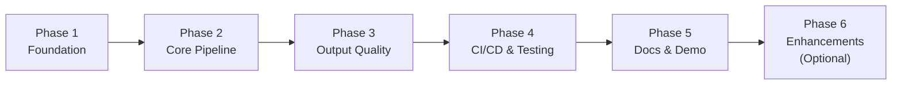

# PAI Take-Home Exercise — Master Plan

**Exercise Spec:** `inputs/PAI-Take_Home_Exercise.md`
**Repository:** `github.com/praeducer/pai-take-home-exercise`

---

## Global Acceptance Criteria

All met as of v1.0.0:

- [x] GitHub repo `praeducer/pai-take-home-exercise` is public
- [x] Pipeline accepts SKU brief JSON and produces images in 3 aspect ratios (1:1, 9:16, 16:9)
- [x] At least 2 products/flavors per run
- [x] S3 organized by `{SKU}/{Region}/{format}/`
- [x] CloudFormation deploys all AWS resources (S3×2, IAM role, Budget alarm)
- [x] GitHub Actions CI/CD passes on main
- [x] README with example I/O, design decisions, backlog
- [x] 8 Claude Code custom skills as interface
- [x] Demo-ready: pipeline completes in under 60 seconds
- [x] `git tag v1.0.0` pushed to origin

---

## Phase Dependency Graph

**Phases 1-5: Complete.** Phase 6 (brand + regulatory checks) is optional — see `phase-06-enhancements.md`.

---

## Decision Gates

| Gate | After | Status |
|------|-------|--------|
| G-001 | Pre-P1 | ✅ Bedrock models verified |
| G-002 | P2 | ✅ First images generated |
| G-003 | P3 | ✅ All 3 aspect ratios |
| G-004 | P4 | ✅ GitHub Actions green |
| G-005 | P5 | ✅ Repo published, v1.0.0 tagged |
