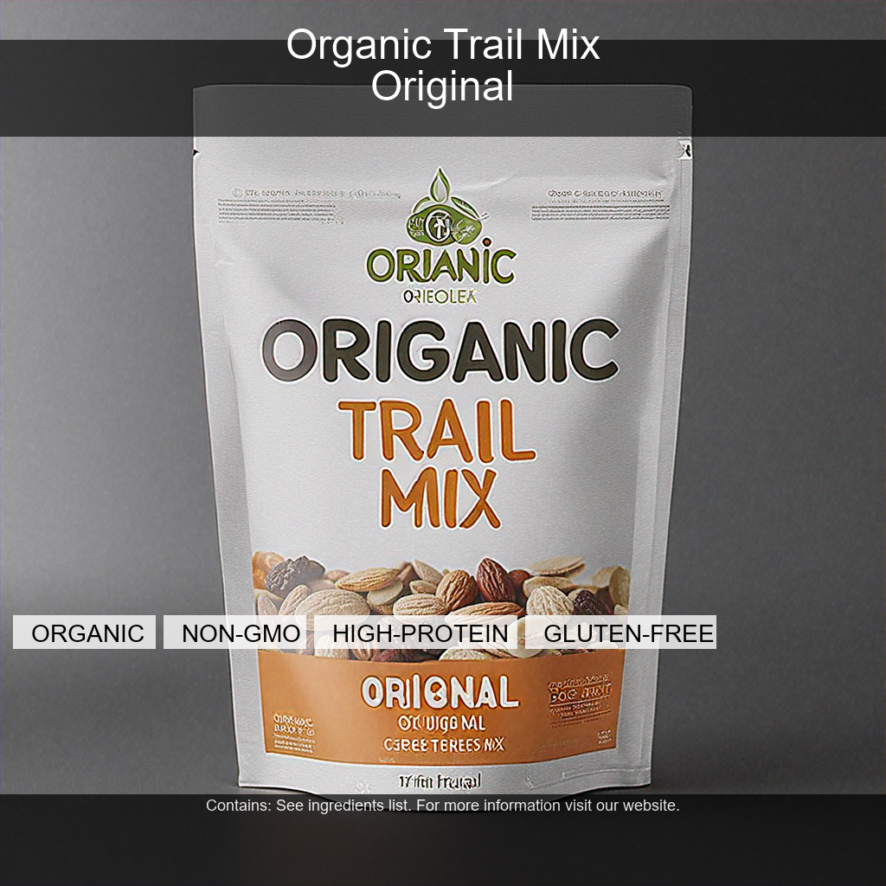
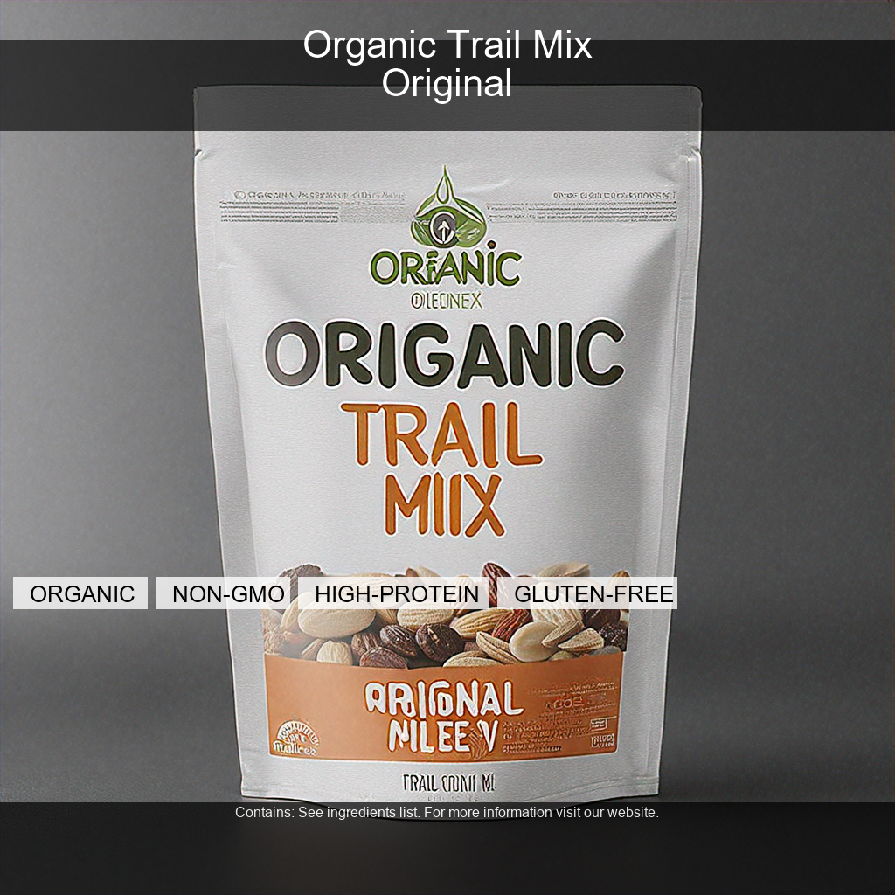
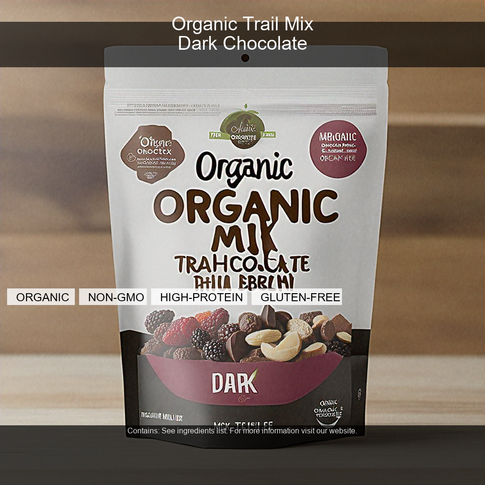
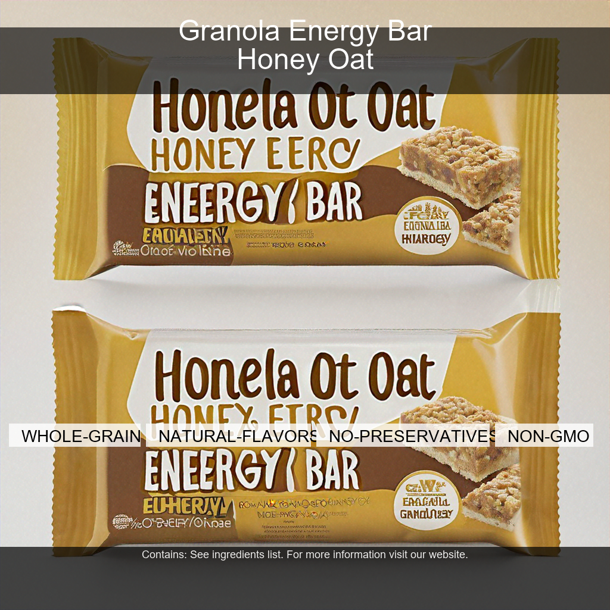
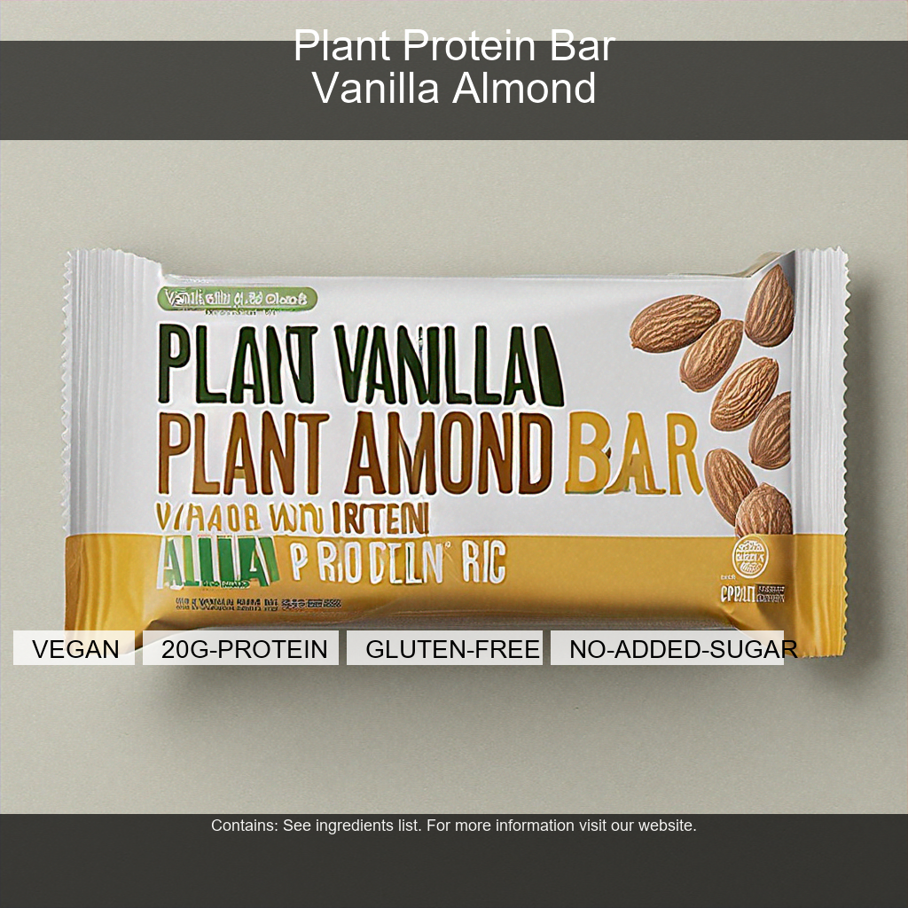
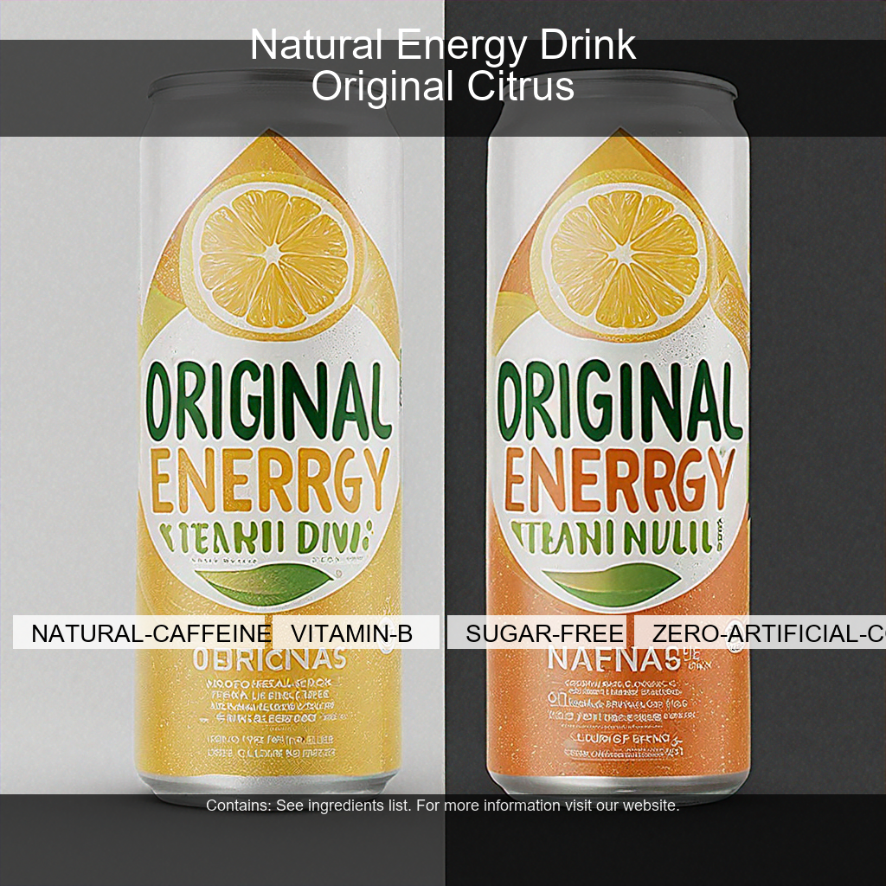

# PAI Packaging Automation PoC

[](https://github.com/praeducer/pai-take-home-exercise/actions/workflows/ci.yml)

GenAI packaging image generation pipeline for the Adobe PAI take-home exercise. Accepts a JSON SKU brief, generates product packaging images in 3 aspect ratios using Amazon Bedrock, composites text overlays with Pillow, and stores outputs in S3. Interface is 8 Claude Code custom skills — no traditional CLI.

---

## Example Output

All images below were generated by this pipeline from JSON briefs in `inputs/`. No post-processing applied.

### Organic Trail Mix — Front Label (1:1, 1024×1024)



### Organic Trail Mix — Back Label (9:16, 576×1024)



### Organic Trail Mix — Wraparound (16:9, 1024×576)



### Granola Energy Bar — LATAM Market (1:1)



### Plant Protein Bar — EU Market (1:1)



### Natural Energy Drink — APAC Market (1:1)



---

## Architecture

```
inputs/sample_sku_brief.json
         │
         ▼
  sku_parser.py          — validate JSON schema
         │
         ▼
  prompt_constructor.py  — build image prompt + overlay content
         │
         ▼
  text_reasoning.py      — Claude Sonnet 4.6 prompt enhancement
         │
         ▼
  image_generator.py     — Bedrock invoke (Nova Canvas / Titan V2)
         │                  SHA-256 content cache at ~/.cache/pai-pipeline/
         ▼
  text_overlay.py        — Pillow RGBA compositing (title, badges, footer)
         │
         ▼
  asset_manager.py       — S3 upload to {sku_id}/{region}/{format}/{file}.png
         │
         ▼
  output_manager.py      — JSON manifest to S3 + outputs/runs/
```

### Key Components

| Component | Technology | Purpose |
|-----------|-----------|---------|
| Image generation | `amazon.nova-canvas-v1:0` (final/iterate tier) | Primary packaging image model |
| Dev/test generation | `amazon.titan-image-generator-v2:0` | $0.01/image, fast iteration |
| Text reasoning | `anthropic.claude-sonnet-4-6` via `anthropic[bedrock]` | Prompt enhancement |
| Text overlay | Pillow (PIL) | Title strip, attribute badges, regulatory footer |
| Storage | Amazon S3 | Outputs at `{sku_id}/{region}/{format}/{product}.png` |
| Manifests | JSON (S3 + local `outputs/runs/`) | Run history, cost tracking |
| Infrastructure | CloudFormation YAML | S3×2, IAM role, Budget alarm |
| CI/CD | GitHub Actions | Lint, test, pip-audit, CF deploy |
| Interface | Claude Code custom skills | 8 skills, no argparse |

---

## Quick Start

**Prerequisites:** Python 3.12, AWS CLI, Claude Code

```bash
# 1. Clone and install
git clone https://github.com/praeducer/pai-take-home-exercise.git
cd pai-take-home-exercise
pip install -r requirements.txt

# 2. Configure AWS (one-time)
aws configure --profile pai-exercise
# Region: us-east-1 (required — Nova Canvas + Claude Sonnet 4.6 only available here)

# 3. Deploy infrastructure
aws cloudformation deploy \
  --stack-name pai-exercise \
  --template-file infra/cloudformation/stack.yaml \
  --capabilities CAPABILITY_NAMED_IAM \
  --profile pai-exercise \
  --region us-east-1

# 4. Get your output bucket name
aws cloudformation describe-stacks \
  --stack-name pai-exercise \
  --profile pai-exercise \
  --query 'Stacks[0].Outputs[?OutputKey==`OutputBucketName`].OutputValue' \
  --output text

# 5. Run the pipeline (in Claude Code)
/run-pipeline inputs/sample_sku_brief.json
```

---

## Example Input

```json
{
  "sku_id": "organic-trail-mix-us",
  "products": [
    {
      "name": "Organic Trail Mix",
      "flavor": "Original",
      "description": "Classic blend of nuts, seeds, and dried fruit for sustained energy"
    },
    {
      "name": "Organic Trail Mix",
      "flavor": "Dark Chocolate",
      "description": "Premium trail mix with fair-trade dark chocolate chips and antioxidant-rich berries"
    }
  ],
  "region": "us-west",
  "audience": "health-conscious adults 25-40",
  "attributes": ["organic", "non-gmo", "high-protein", "gluten-free"]
}
```

Full schema: `src/schemas/sku_brief_schema.json`

---

## Claude Code Skills

| Skill | Invocation | Purpose |
|-------|-----------|---------|
| Run Pipeline | `/run-pipeline` | Generate images from a SKU brief JSON |
| Pipeline Status | `/pipeline-status` | Show recent runs from local manifests |
| View Results | `/view-results` | List/download generated images from S3 |
| Deploy | `/deploy` | Deploy or update CloudFormation stack |
| Teardown | `/teardown` | Destroy CloudFormation stack (with confirmation) |
| Health Check | `/health-check` | Verify AWS resources and Bedrock access |
| Run Tests | `/run-tests` | Execute full test suite |
| Generate Demo | `/generate-demo` | Run pipeline for all 4 demo SKU briefs |

---

## Model Tiers

| Tier | Model | Cost/image | Use case |
|------|-------|-----------|---------|
| `dev` | `amazon.titan-image-generator-v2:0` | $0.01 | Fast iteration, CI-safe |
| `iterate` | `amazon.nova-canvas-v1:0` | $0.04 | Quality review |
| `final` | `amazon.nova-canvas-v1:0` | $0.04 | Demo/production output |

---

## Output Structure

```
outputs/
├── results/                    # Local pipeline output (committed)
│   └── {sku_id}/
│       └── {region}/
│           ├── front_label/    # 1:1 (1024×1024)
│           ├── back_label/     # 9:16 (576×1024)
│           └── wraparound/     # 16:9 (1024×576)
├── runs/                       # JSON manifests (committed)
│   └── {timestamp}_{sku_id}.json
└── demo/                       # Best images for README (committed)
```

S3 key pattern: `{sku_id}/{region}/{format}/{product_slug}.png`

---

## Design Decisions

| Decision | Choice | Why |
|----------|--------|-----|
| Primary image model | Nova Canvas (`nova-canvas-v1:0`) | Only high-quality model in us-east-1 (SD3.5 Large unavailable); TIFA 0.897, ImageReward 1.250 |
| Dev model | Titan V2 | $0.01/image, fast for iteration; generates 1024×1024 only |
| Text reasoning | `anthropic[bedrock]` | Cleaner messages API than raw boto3 InvokeModel |
| Storage | Flat JSON manifests | No database overhead for PoC; PostgreSQL documented in BACKLOG |
| Interface | Claude Code skills | Zero CLI boilerplate; AI-native developer experience |
| IaC | CloudFormation YAML | Self-contained, no npm/Terraform; sufficient for 3 resources |
| CI/CD | GitHub Actions | Must-have for production maturity; SHA-pinned for supply chain safety |
| Image caching | SHA-256 content hash | ~1950x speedup on second run; avoids re-generation cost during dev |

Full technical rationale: [`docs/design-decisions.md`](docs/design-decisions.md)

---

## Assumptions and Limitations

- **Text overlay coordinates** are tuned for English product names ≤30 characters. Other languages/lengths may need adjustment.
- **No real regulatory compliance database** — uses synthesized placeholder footer text ("See ingredients list. For more information visit our website.").
- **Dev tier (Titan V2)** always generates 1024×1024 regardless of aspect ratio. Non-square dimensions (576×1024, 1024×576) are only correct with Nova Canvas (`iterate`/`final` tier).
- **Single-user PoC** — local execution, no production auto-scaling. Lambda + API Gateway is in BACKLOG.
- **Image quality** is demonstration-grade. Not validated against real Adobe packaging brand standards.
- **Bedrock models** auto-enable on first invocation in us-east-1 (no manual subscription required for Nova Canvas and Titan V2). Claude Sonnet 4.6 may require marketplace subscription — see `docs/aws-setup.md`.

---

## Repository Structure

```
├── src/pipeline/          # All pipeline modules
├── tests/                 # 35 unit tests + 1 integration test
├── infra/cloudformation/  # CloudFormation stack
├── inputs/                # SKU brief examples + 4 demo briefs
├── outputs/               # Generated images + manifests
├── docs/                  # AWS setup, design decisions, demo script
└── .github/workflows/     # CI (lint+test+audit) + deploy
```

---

## Development

```bash
make test        # Unit tests only (fast, no AWS required)
make test-all    # All tests including integration
make lint        # ruff check
make audit       # pip-audit security scan
```

---

## Backlog

See [`BACKLOG.md`](BACKLOG.md) for items explicitly deferred from PoC scope: PostgreSQL, Lambda, QuickSight, multi-language support, content moderation, and more.

---

## Security

- IAM role uses least privilege + explicit deny on `s3:Delete*` and `iam:*`
- GitHub Actions uses SHA-pinned actions (supply chain integrity)
- `pip-audit --severity high` runs in every CI build
- See [`docs/security-configuration.md`](docs/security-configuration.md)
