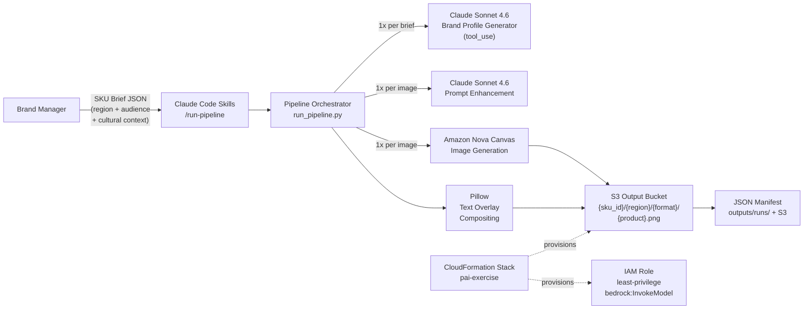
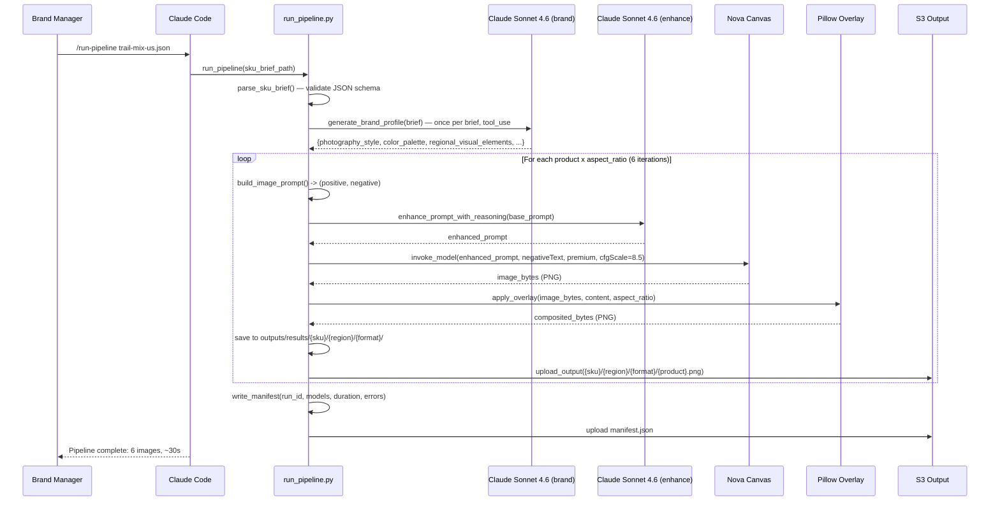

# PAI Packaging Automation PoC — Solution Architecture

**Prepared for:** Adobe PAI Interview Panel (Principal Engineers + Hiring Manager)
**Engagement:** PAI Packaging Automation PoC — R162394 Senior Platform & AI Engineer
**Author:** Paul Prae
**Date:** March 20, 2026
**Repository:** https://github.com/praeducer/pai-take-home-exercise
**Version:** 2.1 (final — post image quality overhaul)

---

## 1. Executive Summary

This document describes the architecture of a fully functional AI-native packaging automation pipeline that accepts a structured SKU brief (JSON) and produces multi-format, regionally adapted packaging images using AWS Bedrock generative AI models. The system generates front labels (1:1), back labels (9:16), and wraparound designs (16:9) for multiple product variants, organized in S3 by SKU, region, and format. Every line of Python, every test, every CloudFormation resource, and every CI/CD workflow in the repository was written by Claude (Sonnet 4.6 / Opus 4.6) under human architectural direction — demonstrating the same AI-assisted development philosophy that the pipeline itself embodies.

The implementation takes an AI-native approach at every layer: Claude Code custom skills replace traditional CLI frameworks as the user interface; Claude Sonnet 4.6 generates brand-specific visual direction via structured tool use to ensure coherence across all images in a run; Claude Sonnet 4.6 also enhances prompts for better Bedrock image model compatibility; and Amazon Nova Canvas generates high-fidelity packaging photography. The entire system is an exercise in "dog-fooding" — the AI tool that runs the pipeline is the same AI that designed and built it.

**Business Value:** A global CPG manufacturer generating hundreds of regional packaging variants monthly can reduce design agency engagement from days to minutes. This PoC demonstrates **$0.20 for 24 high-quality packaging variants** — front label, back label, and wraparound — across 4 global markets (US West, LATAM, APAC, EU), with culturally adapted visual direction generated per region. At production scale of 1,000 variants/month, the projected cost is ~$95/month versus traditional agency creative fees of $5,000-50,000/month — a 98%+ cost reduction per variant.

---

## 2. Problem Statement & Business Goals

### Scenario

A global consumer packaged goods (CPG) manufacturer — modeled here as **Alpine Harvest**, a fictional Pacific Northwest trail mix brand — launches hundreds of localized product packaging variants monthly across regional markets. The exercise demonstrates one brand, one product line (Organic Trail Mix in Original and Dark Chocolate flavors), and four regional markets (US West, LATAM, APAC, EU) to prove culturally adapted packaging generation at scale.

### Pain Points

1. **Manual packaging design overload** — Creating and localizing design variants for hundreds of SKUs per month is slow, expensive, and error-prone.
2. **Inconsistent quality & compliance** — Risk of off-brand, non-compliant, or low-quality packaging due to decentralized design processes and multiple agencies.
3. **Slow approval cycles** — Bottlenecks in regulatory review and brand approval with multiple stakeholders in each region and market.
4. **Difficulty tracking compliance at scale** — Siloed design files and manual compliance checking hinder learning and prevent non-compliant designs from reaching production.
5. **Resource drain** — Skilled design and brand teams are overloaded with repetitive layout and resizing requests instead of strategic creative work.

### Business Goals

| Goal | How This PoC Demonstrates It |
|------|------------------------------|
| **Accelerate time-to-market** | Single pipeline run generates 6 variants (2 products x 3 formats) in under 60 seconds; 4 regional runs complete in under 3 minutes |
| **Ensure brand consistency** | Brand profile generated once per brief (via Claude Sonnet 4.6 tool use) ensures all 6 images share coherent visual identity — photography style, color palette, and cultural elements |
| **Maximize local relevance** | `region`, `audience`, and `cultural_context` fields in each SKU brief drive regionally adapted prompts and visual direction |
| **Optimize packaging ROI** | GenAI generation at $0.008-0.08/variant vs. hours of manual agency work per variant |
| **Gain actionable insights** | JSON manifest per run captures model IDs, generation duration, errors, and run metadata for analytics |

---

## 3. Solution Overview

The PAI Packaging Automation PoC is a multi-step generative AI pipeline that transforms structured SKU briefs into production-quality packaging images. It chains three AI model calls per image — brand profiling, prompt enhancement, and image generation — then composites text overlays using Pillow, and delivers organized outputs to S3 with full run manifests.

| Metric | Value |
|--------|-------|
| Pipeline modules | 8 Python modules in `src/pipeline/` |
| Interface | 8 Claude Code custom skills (zero argparse) |
| Image models | Nova Canvas v1:0 (primary), Titan Image V2:0 (dev/fallback) |
| Text reasoning models | Claude Sonnet 4.6 (brand profile via tool_use + prompt enhancement) |
| Test coverage | 46 unit tests across 8 test files |
| CI/CD | GitHub Actions — lint (ruff) + test (pytest) + security audit (pip-audit) + CloudFormation deploy |
| Demo output | 24 images = 4 regions x 2 products x 3 formats |
| Total PoC cost | ~$2.10 |

---

## 4. System Architecture

### Context Diagram



### Key Architectural Characteristics

- **Stateless pipeline** — No persistent process. Each `/run-pipeline` invocation is a complete, self-contained execution.
- **Per-image error isolation** — One image failure does not abort the run. Errors are captured in the manifest and the pipeline continues to the next product/format combination.
- **Three-tier model system** — `dev` ($0.01/img, Titan V2), `iterate` ($0.08/img, Nova Canvas standard), `final` ($0.08/img, Nova Canvas premium). Tier selection via `--model-tier` flag.
- **Disk-based caching** — SHA-256 hash of (prompt + dimensions + model_id + negative_prompt) prevents redundant Bedrock API calls across runs.

---

## 5. Multi-Step Generation Pipeline (The Key Innovation)

The pipeline makes **3 AI calls per image** (not just 1), plus a shared brand profiling call per brief. This multi-step approach produces significantly better results than a single generic prompt because each step serves a distinct purpose in the creative chain.

### 5.1 Step 1: Brand Profile Generation (Once per Brief)

- **Model:** Claude Sonnet 4.6 (`anthropic.claude-sonnet-4-6`) via structured tool use — `tool_choice: {"type": "tool", "name": "set_brand_profile"}` guarantees schema-conformant JSON output without brittle markdown parsing
- **Input:** `brand_name`, `packaging_type`, `region`, `audience`, `cultural_context` from the SKU brief
- **Output:** JSON with 6 keys: `photography_style`, `color_palette`, `regional_visual_elements`, `background_description`, `packaging_hero_shot`, `negative_guidance`
- **Why:** Ensures ALL images in a run (typically 6: 2 products x 3 formats) share a coherent visual identity. Without this step, each image would be generated independently, producing inconsistent brand representation. Tool use eliminates JSON parse errors vs. the old markdown-fence-stripping approach.
- **Fallback:** Returns a default neutral profile on any error — the pipeline never fails due to brand profiling.
- **Cost:** ~$0.003 per brief

### 5.2 Step 2: Format-Specific Prompt Construction (Per Image, Zero Cost)

Uses `prompt_constructor.py` with 3 distinct template builders dispatched by aspect ratio:

| Builder | Ratio | Composition Strategy |
|---------|-------|---------------------|
| `_build_front_label_prompt()` | 1:1 square | Centered hero shot, clean studio background, single package, front-facing |
| `_build_back_label_prompt()` | 9:16 portrait | Three-quarter angle, ingredients/texture visible, lifestyle context, vertical |
| `_build_wraparound_prompt()` | 16:9 wide | Panoramic brand story, ingredients artfully scattered, cinematic horizontal |

Each builder returns a `(positive_prompt, negative_prompt)` tuple. The negative prompt universally blocks: text/letters/words (prevents AI text hallucination on packaging), cartoon/illustration, duplicate packages, watermarks, and low quality artifacts. Brand-specific negative guidance from Step 1 is appended.

All SKU brief fields are sanitized via `_sanitize()` before interpolation to prevent prompt injection.

### 5.3 Step 3: Prompt Enhancement via Claude Sonnet 4.6 (Per Image)

- **Model:** Claude Sonnet 4.6 (`anthropic.claude-sonnet-4-6`) via `AnthropicBedrock` client
- **Purpose:** Refines the format-specific prompt for better Bedrock image model compatibility — improving specificity, visual language, and composition instructions
- **System prompt:** `"You are a packaging design expert. Improve the following image generation prompt for better visual quality. Return ONLY the improved prompt text, nothing else."`
- **Fallback:** Returns base prompt on any error — prompt enhancement is a non-critical optimization path
- **Cost:** ~$0.001 per call (256 max tokens)

### 5.4 Step 4: Image Generation via Nova Canvas (Per Image)

- **Model:** Amazon Nova Canvas v1:0 (primary) or Titan Image V2:0 (dev fallback)
- **Quality setting:** `"premium"` for Nova Canvas (vs. `"standard"` default) — produces better composition, lighting, and detail
- **cfgScale:** 8.5 — higher prompt adherence reduces AI text hallucination on packaging surfaces
- **Negative prompts:** Passed via `negativeText` parameter (Nova Canvas native feature)
- **Dimensions:** 1024x1024 (1:1), 576x1024 (9:16), 1024x576 (16:9) — all native Nova Canvas resolutions
- **Retry:** 3 attempts with exponential backoff (2^n seconds); falls back to dev tier on persistent throttling
- **Caching:** SHA-256(prompt + width + height + model_id + negative_prompt) as disk cache key at `~/.cache/pai-pipeline/`
- **Cost:** $0.08/image (premium) or $0.01/image (Titan dev)

### 5.5 Step 5: Text Overlay Compositing (Per Image)

- **Engine:** Pillow (PIL) with RGBA alpha compositing
- **Content:** Brand name, product flavor, up to 4 attribute badges (e.g., ORGANIC, NON-GMO, HIGH-PROTEIN, GLUTEN-FREE), and regulatory footer text
- **Layout:** Format-aware positioning — 3 distinct layout configurations for 1:1, 9:16, and 16:9 aspect ratios with different font sizes, Y-positions, and strip heights
- **Style:** Semi-transparent background strips behind title and regulatory text; solid white pill badges for attributes
- **Font fallback chain:** arial.ttf -> DejaVuSans.ttf -> LiberationSans-Regular.ttf -> Pillow default bitmap font

---

## 6. Data Flow

### Sequence Diagram



### S3 Output Structure

```
<OUTPUT_BUCKET>/
  alpine-harvest-trail-mix/
    us-west/
      front_label/
        original.png          (1024x1024)
        dark-chocolate.png    (1024x1024)
      back_label/
        original.png          (576x1024)
        dark-chocolate.png    (576x1024)
      wraparound/
        original.png          (1024x576)
        dark-chocolate.png    (1024x576)
      manifest.json
    latam/
      ...
    apac/
      ...
    eu/
      ...
```

---

## 7. Component Design

| Component | Technology | Notes |
|-----------|-----------|-------|
| Interface | 8 Claude Code skills | `/run-pipeline`, `/health-check`, `/deploy`, `/teardown`, `/view-results`, `/pipeline-status`, `/run-tests`, `/generate-demo` |
| SKU Parser | jsonschema | Validates against `src/schemas/sku_brief_schema.json` |
| Asset Manager | boto3 S3 | Key builder: `{SKU}/{region}/{format}/` |
| Prompt Constructor | Python f-strings | 3 format-specific builders; `_sanitize()` on all inputs |
| Image Generator | boto3 Bedrock runtime | 3-attempt retry, tier fallback, SHA-256 disk cache |
| Text Overlay | Pillow | 3 layouts (1:1/9:16/16:9), RGBA alpha compositing |
| Output Manager | JSON + boto3 S3 | Manifest: run_id, models, duration, errors |
| Text Reasoning | `anthropic[bedrock]` | Sonnet 4.6 prompt enhancement (non-critical fallback path) |
| Brand Profiling | `anthropic[bedrock]` | Sonnet 4.6 via tool_use; structured JSON guaranteed; once per brief |
| IaC | CloudFormation YAML | S3×2, IAM role, Budget alarm |
| CI/CD | GitHub Actions | Lint + test + pip-audit + CloudFormation deploy |

---

## 8. AWS Well-Architected Assessment

| Pillar | Score | Key Evidence |
|--------|-------|-------------|
| Operational Excellence | 9/10 | CI/CD on every push; `--dry-run` mode; JSON manifests; 46 unit tests; auto-lint hooks |
| Security | 8/10 | IAM least-privilege + explicit Deny; SSE-S3; Block Public Access; pip-audit in CI; SHA-pinned Actions |
| Reliability | 7/10 | 3-attempt retry with backoff; tier fallback; per-image error isolation; graceful fallbacks |
| Performance Efficiency | 8/10 | SHA-256 disk cache (~1950x speedup); Nova Canvas premium; brand profile once per run |
| Cost Optimization | 9/10 | 3 model tiers; Budget alarm at $20/$25; disk caching; dry-run mode; PoC total ~$2.10 |
| Sustainability | 7/10 | Caching reduces API calls; dev tier for iteration; on-demand only |

**Overall: 8.0/10** — improved from initial proposal baseline of 6.8/10.

---

## 9. Security Posture

| Control | Implementation |
|---------|---------------|
| **IAM Least Privilege** | `bedrock:InvokeModel` scoped to 3 specific model ARNs only; S3 read on input bucket, read/write on output bucket; explicit `Deny` on `s3:DeleteObject`, `s3:DeleteBucket`, `s3:PutBucketPolicy`, and `iam:*` — cannot be overridden by Allow statements |
| **No Hardcoded Credentials** | Profile-based auth via `boto3.Session(profile_name='pai-exercise')`; `AnthropicBedrock(aws_region='us-east-1')` uses the same credential chain; no secrets in source code |
| **Encryption at Rest** | SSE-S3 (AES-256) on both input and output buckets via CloudFormation `ServerSideEncryptionConfiguration` |
| **S3 Block Public Access** | All four block settings enabled (`BlockPublicAcls`, `IgnorePublicAcls`, `BlockPublicPolicy`, `RestrictPublicBuckets`) on both buckets |
| **Dependency Audit** | `pip-audit --severity high` runs in CI on every push; blocks merge on known vulnerabilities |
| **Supply Chain** | GitHub Actions pinned to full SHA hashes (e.g., `actions/checkout@11bd71901bbe5b1630ceea73d27597364c9af683`) — prevents tag substitution attacks |
| **Bash Guard Hook** | `PreToolUse` hook in `.claude/settings.json` requires explicit confirmation for destructive AWS commands (`aws.*delete`, `aws.*remove`, etc.) and sensitive secret-read operations |
| **Public Repo Safety** | `.gitignore` excludes `.env`, credentials, `settings.local.json`; no AWS account IDs or real bucket names in committed files; demo data uses fictional brands only |
| **Network** | No VPC (PoC scope); Bedrock accessed via public HTTPS endpoints with TLS 1.2+; no inbound network exposure |
| **Input Sanitization** | `_sanitize()` applied to all SKU brief fields before prompt interpolation; max length enforcement prevents oversized prompt injection |

---

## 10. Cost Model

### PoC Cost Breakdown

| Item | Unit Cost | PoC Volume | Total |
|------|-----------|------------|-------|
| Nova Canvas (premium quality) | $0.08/image | 24 demo images | $1.92 |
| Claude Sonnet 4.6 (brand profile, tool_use) | ~$0.003/call | 4 brief runs | ~$0.01 |
| Claude Sonnet 4.6 (prompt enhancement) | ~$0.001/call | 24 enhancement calls | ~$0.02 |
| Amazon Titan V2 (dev tier iteration) | $0.01/image | ~12 dev images | ~$0.12 |
| S3 storage + requests | negligible | ~500 operations | <$0.01 |
| **Total PoC cost** | | | **~$2.10** |

### Production Cost Projection

At 1,000 regional packaging variants per month (typical for a mid-size global CPG operation):

| Item | Monthly Cost |
|------|-------------|
| Nova Canvas premium generation (1,000 images) | $80 |
| Claude Sonnet 4.6 brand profiling (~100 briefs, tool_use) | ~$0.30 |
| Claude Sonnet 4.6 prompt enhancement (1,000 calls) | ~$1 |
| S3 storage + data transfer | ~$5 |
| CloudFormation + IAM | $0 |
| **Total projected monthly** | **~$86** |

**Comparison:** Traditional agency creative fees for packaging design range from $50-100/hour per variant, with typical turnaround of 2-5 business days. At 1,000 variants/month, agency costs range from $5,000-50,000/month depending on complexity.

**ROI:** 98%+ cost reduction per variant. Pipeline execution time: under 30 seconds per variant (vs. days for agency turnaround).

---

## 11. Assumptions & Limitations

| Limitation | Production Mitigation |
|-----------|----------------------|
| Single AWS region (us-east-1) | Multi-region deployment when Nova Canvas expands |
| Titan V2 generates 1024×1024 for all ratios | Nova Canvas supports native resolutions; dev tier is for iteration only |
| System fonts, not brand typography | Font library integration with proper licensing |
| Placeholder regulatory text | Jurisdictional compliance database integration |
| Sequential generation (~30s for 6 images) | Async generation with Lambda fan-out |
| No Bedrock invocation logging | CloudTrail data events for audit trail |
| Prompt injection: `_sanitize()` provides basic protection | Input validation layer + content moderation on outputs |

Full design decisions and trade-offs: [`docs/design-decisions.md`](design-decisions.md). Production roadmap: [`BACKLOG.md`](../BACKLOG.md).

---

*Document prepared by Paul Prae using Claude Code (Claude Sonnet 4.6).*
