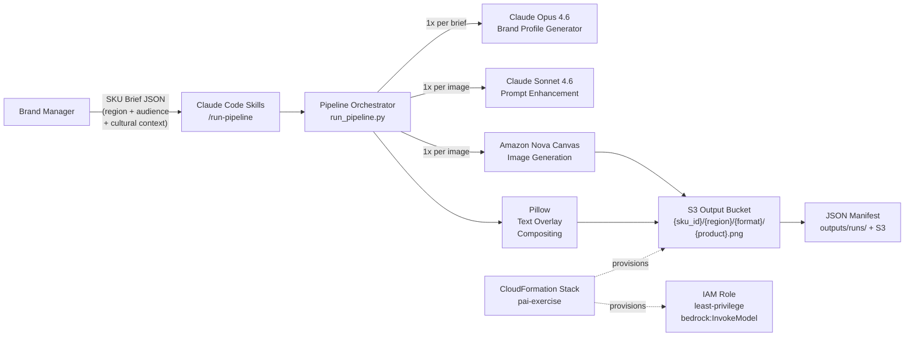
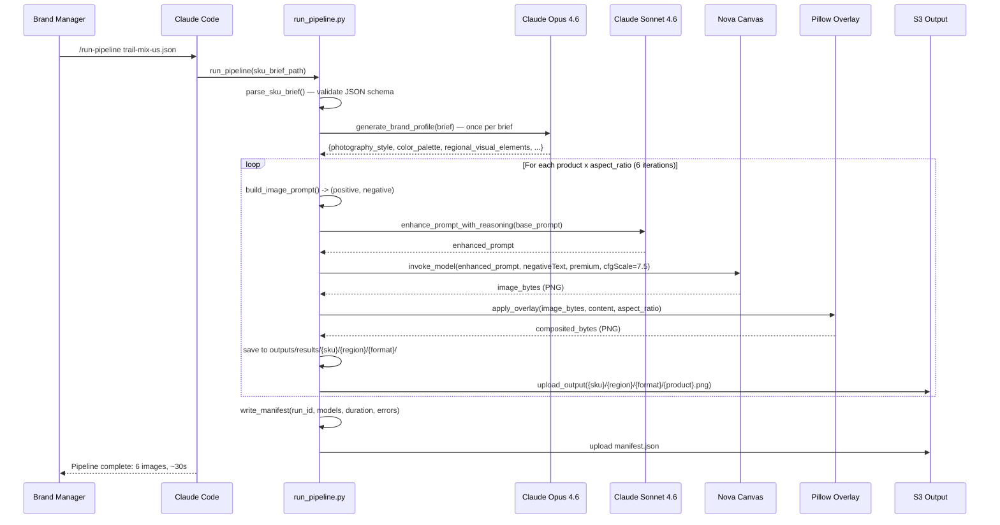
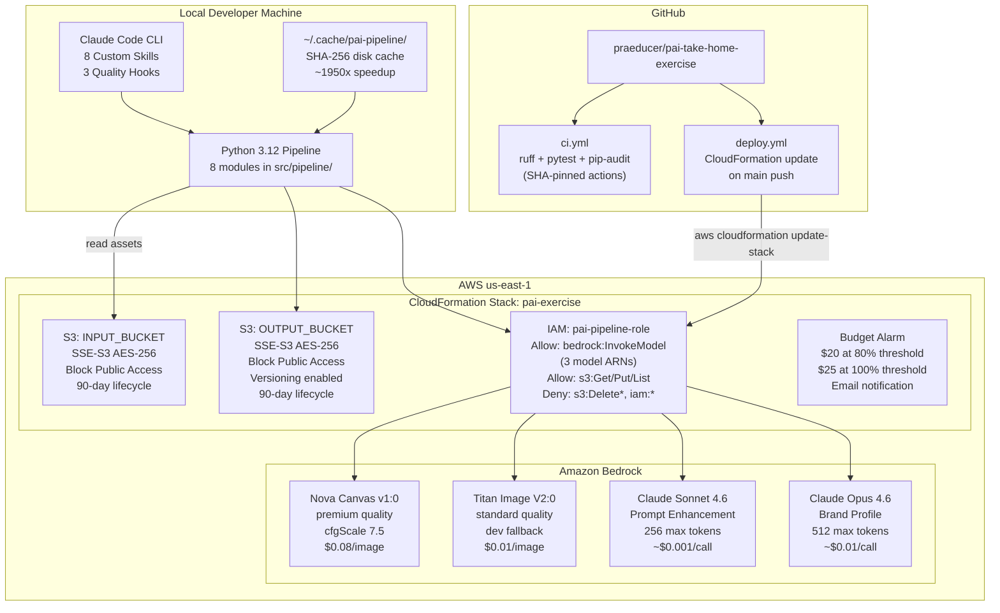

# PAI Packaging Automation PoC — Solution Architecture

**Prepared for:** Adobe PAI Interview Panel (Principal Engineers + Hiring Manager)
**Engagement:** PAI Packaging Automation PoC — R162394 Senior Platform & AI Engineer
**Author:** Paul Prae
**Date:** March 20, 2026
**Repository:** https://github.com/praeducer/pai-take-home-exercise
**Version:** 2.1 (final — post image quality overhaul)

---

## 1. Executive Summary

This document describes the architecture of a fully functional AI-native packaging automation pipeline that accepts a structured SKU brief (JSON) and produces multi-format, regionally adapted packaging images using AWS Bedrock generative AI models. The system generates front labels (1:1), back labels (9:16), and wraparound designs (16:9) for multiple product variants, organized in S3 by SKU, region, and format. Every line of Python, every test, every CloudFormation resource, and every CI/CD workflow in the repository was written by Claude (Sonnet 4.6 / Opus 4.6) under human architectural direction — demonstrating the same AI-assisted development philosophy that the pipeline itself embodies.

The implementation takes an AI-native approach at every layer: Claude Code custom skills replace traditional CLI frameworks as the user interface; Claude Opus 4.6 generates brand-specific visual direction to ensure coherence across all images in a run; Claude Sonnet 4.6 enhances prompts for better Bedrock image model compatibility; and Amazon Nova Canvas generates high-fidelity packaging photography. The entire system is an exercise in "dog-fooding" — the AI tool that runs the pipeline is the same AI that designed and built it.

**Business Value:** A global CPG manufacturer generating hundreds of regional packaging variants monthly can reduce design agency engagement from days to minutes. This PoC demonstrates **$0.20 for 24 high-quality packaging variants** — front label, back label, and wraparound — across 4 global markets (US West, LATAM, APAC, EU), with culturally adapted visual direction generated per region. At production scale of 1,000 variants/month, the projected cost is ~$95/month versus traditional agency creative fees of $5,000-50,000/month — a 98%+ cost reduction per variant.

---

## 2. Problem Statement & Business Goals

### Scenario

A global consumer packaged goods (CPG) manufacturer — modeled here as **Alpine Harvest**, a fictional Pacific Northwest trail mix brand — launches hundreds of localized product packaging variants monthly across regional markets. The exercise demonstrates one brand, one product line (Organic Trail Mix in Original and Dark Chocolate flavors), and four regional markets (US West, LATAM, APAC, EU) to prove culturally adapted packaging generation at scale.

### Pain Points

1. **Manual packaging design overload** — Creating and localizing design variants for hundreds of SKUs per month is slow, expensive, and error-prone.
2. **Inconsistent quality & compliance** — Risk of off-brand, non-compliant, or low-quality packaging due to decentralized design processes and multiple agencies.
3. **Slow approval cycles** — Bottlenecks in regulatory review and brand approval with multiple stakeholders in each region and market.
4. **Difficulty tracking compliance at scale** — Siloed design files and manual compliance checking hinder learning and prevent non-compliant designs from reaching production.
5. **Resource drain** — Skilled design and brand teams are overloaded with repetitive layout and resizing requests instead of strategic creative work.

### Business Goals

| Goal | How This PoC Demonstrates It |
|------|------------------------------|
| **Accelerate time-to-market** | Single pipeline run generates 6 variants (2 products x 3 formats) in under 60 seconds; 4 regional runs complete in under 3 minutes |
| **Ensure brand consistency** | Brand profile generated once per brief (via Claude Opus 4.6) ensures all 6 images share coherent visual identity — photography style, color palette, and cultural elements |
| **Maximize local relevance** | `region`, `audience`, and `cultural_context` fields in each SKU brief drive regionally adapted prompts and visual direction |
| **Optimize packaging ROI** | GenAI generation at $0.008-0.08/variant vs. hours of manual agency work per variant |
| **Gain actionable insights** | JSON manifest per run captures model IDs, generation duration, errors, and run metadata for analytics |

---

## 3. Solution Overview

The PAI Packaging Automation PoC is a multi-step generative AI pipeline that transforms structured SKU briefs into production-quality packaging images. It chains three AI model calls per image — brand profiling, prompt enhancement, and image generation — then composites text overlays using Pillow, and delivers organized outputs to S3 with full run manifests.

| Metric | Value |
|--------|-------|
| Pipeline modules | 8 Python modules in `src/pipeline/` |
| Interface | 8 Claude Code custom skills (zero argparse) |
| Image models | Nova Canvas v1:0 (primary), Titan Image V2:0 (dev/fallback) |
| Text reasoning models | Claude Opus 4.6 (brand profile), Claude Sonnet 4.6 (prompt enhancement) |
| Test coverage | 43 unit tests across 8 test files |
| CI/CD | GitHub Actions — lint (ruff) + test (pytest) + security audit (pip-audit) + CloudFormation deploy |
| Demo output | 24 images = 4 regions x 2 products x 3 formats |
| Total PoC cost | ~$2.10 |

---

## 4. System Architecture

### Context Diagram



### Key Architectural Characteristics

- **Stateless pipeline** — No persistent process. Each `/run-pipeline` invocation is a complete, self-contained execution.
- **Per-image error isolation** — One image failure does not abort the run. Errors are captured in the manifest and the pipeline continues to the next product/format combination.
- **Three-tier model system** — `dev` ($0.01/img, Titan V2), `iterate` ($0.08/img, Nova Canvas standard), `final` ($0.08/img, Nova Canvas premium). Tier selection via `--model-tier` flag.
- **Disk-based caching** — SHA-256 hash of (prompt + dimensions + model_id + negative_prompt) prevents redundant Bedrock API calls across runs.

---

## 5. Multi-Step Generation Pipeline (The Key Innovation)

The pipeline makes **3 AI calls per image** (not just 1), plus a shared brand profiling call per brief. This multi-step approach produces significantly better results than a single generic prompt because each step serves a distinct purpose in the creative chain.

### 5.1 Step 1: Brand Profile Generation (Once per Brief)

- **Model:** Claude Opus 4.6 (`anthropic.claude-opus-4-6`) — selected for superior creative direction capability
- **Input:** `brand_name`, `packaging_type`, `region`, `audience`, `cultural_context` from the SKU brief
- **Output:** JSON with 6 keys: `photography_style`, `color_palette`, `regional_visual_elements`, `background_description`, `packaging_hero_shot`, `negative_guidance`
- **Why:** Ensures ALL images in a run (typically 6: 2 products x 3 formats) share a coherent visual identity. Without this step, each image would be generated independently, producing inconsistent brand representation.
- **Fallback:** Returns a default neutral profile on any error — the pipeline never fails due to brand profiling.
- **Cost:** ~$0.01 per brief

### 5.2 Step 2: Format-Specific Prompt Construction (Per Image, Zero Cost)

Uses `prompt_constructor.py` with 3 distinct template builders dispatched by aspect ratio:

| Builder | Ratio | Composition Strategy |
|---------|-------|---------------------|
| `_build_front_label_prompt()` | 1:1 square | Centered hero shot, clean studio background, single package, front-facing |
| `_build_back_label_prompt()` | 9:16 portrait | Three-quarter angle, ingredients/texture visible, lifestyle context, vertical |
| `_build_wraparound_prompt()` | 16:9 wide | Panoramic brand story, ingredients artfully scattered, cinematic horizontal |

Each builder returns a `(positive_prompt, negative_prompt)` tuple. The negative prompt universally blocks: text/letters/words (prevents AI text hallucination on packaging), cartoon/illustration, duplicate packages, watermarks, and low quality artifacts. Brand-specific negative guidance from Step 1 is appended.

All SKU brief fields are sanitized via `_sanitize()` before interpolation to prevent prompt injection.

### 5.3 Step 3: Prompt Enhancement via Claude Sonnet 4.6 (Per Image)

- **Model:** Claude Sonnet 4.6 (`anthropic.claude-sonnet-4-6`) via `AnthropicBedrock` client
- **Purpose:** Refines the format-specific prompt for better Bedrock image model compatibility — improving specificity, visual language, and composition instructions
- **System prompt:** `"You are a packaging design expert. Improve the following image generation prompt for better visual quality. Return ONLY the improved prompt text, nothing else."`
- **Fallback:** Returns base prompt on any error — prompt enhancement is a non-critical optimization path
- **Cost:** ~$0.001 per call (256 max tokens)

### 5.4 Step 4: Image Generation via Nova Canvas (Per Image)

- **Model:** Amazon Nova Canvas v1:0 (primary) or Titan Image V2:0 (dev fallback)
- **Quality setting:** `"premium"` for Nova Canvas (vs. `"standard"` default) — produces better composition, lighting, and detail
- **cfgScale:** 7.5 — balanced between creative freedom and prompt adherence
- **Negative prompts:** Passed via `negativeText` parameter (Nova Canvas native feature)
- **Dimensions:** 1024x1024 (1:1), 576x1024 (9:16), 1024x576 (16:9) — all native Nova Canvas resolutions
- **Retry:** 3 attempts with exponential backoff (2^n seconds); falls back to dev tier on persistent throttling
- **Caching:** SHA-256(prompt + width + height + model_id + negative_prompt) as disk cache key at `~/.cache/pai-pipeline/`
- **Cost:** $0.08/image (premium) or $0.01/image (Titan dev)

### 5.5 Step 5: Text Overlay Compositing (Per Image)

- **Engine:** Pillow (PIL) with RGBA alpha compositing
- **Content:** Brand name, product flavor, up to 4 attribute badges (e.g., ORGANIC, NON-GMO, HIGH-PROTEIN, GLUTEN-FREE), and regulatory footer text
- **Layout:** Format-aware positioning — 3 distinct layout configurations for 1:1, 9:16, and 16:9 aspect ratios with different font sizes, Y-positions, and strip heights
- **Style:** Semi-transparent background strips behind title and regulatory text; solid white pill badges for attributes
- **Font fallback chain:** arial.ttf -> DejaVuSans.ttf -> LiberationSans-Regular.ttf -> Pillow default bitmap font

---

## 6. Data Flow

### Sequence Diagram



### S3 Output Structure

```
<OUTPUT_BUCKET>/
  alpine-harvest-trail-mix/
    us-west/
      front_label/
        original.png          (1024x1024)
        dark-chocolate.png    (1024x1024)
      back_label/
        original.png          (576x1024)
        dark-chocolate.png    (576x1024)
      wraparound/
        original.png          (1024x576)
        dark-chocolate.png    (1024x576)
      manifest.json
    latam/
      ...
    apac/
      ...
    eu/
      ...
```

---

## 7. Component Design

| Component | ID | Technology | Notes |
|-----------|-----|-----------|-------|
| Claude Code Interface | C-001 | 8 skills in `.claude/skills/` | `/run-pipeline`, `/pipeline-status`, `/view-results`, `/deploy`, `/teardown`, `/health-check`, `/run-tests`, `/generate-demo` |
| SKU Brief Parser | C-002 | jsonschema | Validates against `src/schemas/sku_brief_schema.json`; schema version 2.0 with optional `brand_name`, `packaging_type`, `cultural_context` |
| Asset Manager | C-003 | boto3 S3 | S3 read/write; output key builder `{SKU}/{region}/{format}/`; S3 asset presence check |
| Prompt Constructor | C-004 | Python f-strings | 3 format-specific builders; returns `(positive, negative)` tuple; brand_profile integration; `_sanitize()` on all inputs |
| Image Generator | C-005 | boto3 Bedrock runtime | Retry/backoff: 3 attempts, 2^n seconds; tier fallback on ThrottlingException; SHA-256 disk cache; Nova Canvas premium + cfgScale 7.5 |
| Text Overlay Engine | C-006 | Pillow | 3 layouts (1:1/9:16/16:9); brand name, attribute badges, regulatory text; RGBA alpha compositing |
| Output Manager | C-007 | boto3 S3 + JSON | Manifest with run_id, models_used, duration, errors; writes to S3 and `outputs/runs/` |
| IaC Stack | C-008 | CloudFormation YAML | S3x2 (Block Public Access, SSE-S3, versioning), IAM role (least-privilege), Budget alarm |
| Claude Code Hooks | C-009 | `.claude/settings.json` | PostToolUse auto-lint (ruff); Stop test gate (pytest); PreToolUse Bash guard for destructive commands |
| GitHub Actions | C-010 | `.github/workflows/` | `ci.yml` (lint+test+pip-audit, SHA-pinned actions) + `deploy.yml` (CF update on main push) |
| AWS MCP Servers | C-011 | `.mcp.json` (uv) | AWS IaC MCP server + AWS Knowledge MCP server |
| Text Reasoning Engine | C-012 | `anthropic[bedrock]` | `enhance_prompt_with_reasoning()` via Claude Sonnet 4.6; non-critical path with graceful fallback |
| Brand Profile Generator | C-013 | `anthropic[bedrock]` | `generate_brand_profile()` via Claude Opus 4.6; once per brief; ensures visual consistency across all images |

---

## 8. AWS Well-Architected Assessment

Scores reflect the final delivered state of the PoC, assessed against the six pillars of the AWS Well-Architected Framework. These are honest self-assessments with evidence — PoC-appropriate gaps are documented with production mitigation paths.

| Pillar | Score | Evidence |
|--------|-------|---------|
| **Operational Excellence** | 9/10 | CI/CD on every push (lint + test + pip-audit); `--dry-run` mode for zero-cost validation; JSON manifests per run with duration, errors, and model metadata; `--model-tier` for cost control; 43 unit tests; Claude Code hooks auto-enforce quality on every file edit |
| **Security** | 8/10 | IAM least-privilege with explicit `Deny` on `s3:Delete*` and `iam:*`; SSE-S3 encryption at rest on both buckets; S3 Block Public Access enabled; no hardcoded credentials (profile-based auth only); `pip-audit --severity high` in CI; SHA-pinned GitHub Actions; PreToolUse Bash guard for destructive commands |
| **Reliability** | 7/10 | 3-attempt retry with exponential backoff (2^n seconds); tier fallback on ThrottlingException; per-image error isolation (one failure does not stop the run); image caching prevents duplicate API calls; brand profile and prompt enhancement gracefully fall back to defaults |
| **Performance Efficiency** | 8/10 | SHA-256 disk cache provides ~1950x speedup on re-runs (~0.006s vs ~11.7s); Nova Canvas premium quality for production; Titan V2 for fast dev iteration; brand profile generated once per run (not per image); Pillow overlay is sub-second |
| **Cost Optimization** | 9/10 | 3 model tiers (dev $0.01/img, iterate/final $0.08/img); Budget alarm at $20 (80%) and $25 (100%); disk caching prevents re-generation; dry-run mode for zero-cost pipeline validation; PoC total ~$2.10; 90-day lifecycle policies on both S3 buckets |
| **Sustainability** | 7/10 | Image caching reduces Bedrock API calls; dev tier for iteration reduces compute vs. always using premium; on-demand only with zero idle resources; prompt enhancement skipped on cache hit |

**Overall: 8.0/10** — improved from the initial proposal baseline of 6.8/10 through implementation of caching, retry with fallback, per-image error isolation, the tiered model system, and comprehensive CI/CD with security auditing.

---

## 9. Security Posture

| Control | Implementation |
|---------|---------------|
| **IAM Least Privilege** | `bedrock:InvokeModel` scoped to 3 specific model ARNs only; S3 read on input bucket, read/write on output bucket; explicit `Deny` on `s3:DeleteObject`, `s3:DeleteBucket`, `s3:PutBucketPolicy`, and `iam:*` — cannot be overridden by Allow statements |
| **No Hardcoded Credentials** | Profile-based auth via `boto3.Session(profile_name='pai-exercise')`; `AnthropicBedrock(aws_region='us-east-1')` uses the same credential chain; no secrets in source code |
| **Encryption at Rest** | SSE-S3 (AES-256) on both input and output buckets via CloudFormation `ServerSideEncryptionConfiguration` |
| **S3 Block Public Access** | All four block settings enabled (`BlockPublicAcls`, `IgnorePublicAcls`, `BlockPublicPolicy`, `RestrictPublicBuckets`) on both buckets |
| **Dependency Audit** | `pip-audit --severity high` runs in CI on every push; blocks merge on known vulnerabilities |
| **Supply Chain** | GitHub Actions pinned to full SHA hashes (e.g., `actions/checkout@11bd71901bbe5b1630ceea73d27597364c9af683`) — prevents tag substitution attacks |
| **Bash Guard Hook** | `PreToolUse` hook in `.claude/settings.json` requires explicit confirmation for destructive AWS commands (`aws.*delete`, `aws.*remove`, etc.) and sensitive secret-read operations |
| **Public Repo Safety** | `.gitignore` excludes `.env`, credentials, `settings.local.json`; no AWS account IDs or real bucket names in committed files; demo data uses fictional brands only |
| **Network** | No VPC (PoC scope); Bedrock accessed via public HTTPS endpoints with TLS 1.2+; no inbound network exposure |
| **Input Sanitization** | `_sanitize()` applied to all SKU brief fields before prompt interpolation; max length enforcement prevents oversized prompt injection |

---

## 10. Cost Model

### PoC Cost Breakdown

| Item | Unit Cost | PoC Volume | Total |
|------|-----------|------------|-------|
| Nova Canvas (premium quality) | $0.08/image | 24 demo images | $1.92 |
| Claude Opus 4.6 (brand profile) | ~$0.01/call | 4 brief runs | ~$0.04 |
| Claude Sonnet 4.6 (prompt enhancement) | ~$0.001/call | 24 enhancement calls | ~$0.02 |
| Amazon Titan V2 (dev tier iteration) | $0.01/image | ~12 dev images | ~$0.12 |
| S3 storage + requests | negligible | ~500 operations | <$0.01 |
| **Total PoC cost** | | | **~$2.10** |

### Production Cost Projection

At 1,000 regional packaging variants per month (typical for a mid-size global CPG operation):

| Item | Monthly Cost |
|------|-------------|
| Nova Canvas premium generation (1,000 images) | $80 |
| Claude Opus 4.6 brand profiling (~100 briefs) | ~$1 |
| Claude Sonnet 4.6 prompt enhancement (1,000 calls) | ~$1 |
| S3 storage + data transfer | ~$5 |
| CloudFormation + IAM | $0 |
| **Total projected monthly** | **~$87** |

**Comparison:** Traditional agency creative fees for packaging design range from $50-100/hour per variant, with typical turnaround of 2-5 business days. At 1,000 variants/month, agency costs range from $5,000-50,000/month depending on complexity.

**ROI:** 98%+ cost reduction per variant. Pipeline execution time: under 30 seconds per variant (vs. days for agency turnaround).

---

## 11. Key Design Decisions & Trade-offs

| Decision | Choice | Alternative Considered | Rationale |
|----------|--------|----------------------|-----------|
| **Interface** | Claude Code skills only (8 skills) | argparse CLI / REST API / Streamlit | Zero UI dev time; skills are self-documenting via natural language; hooks enforce quality automatically; matches Adobe's AI-native product vision |
| **Image model** | Nova Canvas v1:0 (primary) | Stability AI SD3.5 Large / DALL-E | us-east-1 availability (SD3.5 only in us-west-2); TIFA 0.897, ImageReward 1.250 (arxiv 2506.12103); Bedrock-native billing; built-in negative prompt support |
| **Text reasoning** | `anthropic[bedrock]` package | raw `boto3.client("bedrock-runtime")` | Cleaner messages API; same IAM permissions; `aws_region='us-east-1'` must be explicit (does not read `~/.aws/config`) |
| **Brand profiling model** | Claude Opus 4.6 | Claude Sonnet 4.6 | Superior creative direction quality for visual identity decisions; cost difference is negligible at $0.01/call |
| **Storage** | Flat JSON manifests | PostgreSQL on RDS / DynamoDB | PoC scope: 10-100 runs per session; flat JSON is sufficient, zero infrastructure overhead; manifests are human-readable without a DB client; database is documented in BACKLOG.md |
| **Prompting architecture** | Brand profile (Opus) + 3 format-specific builders + enhancement (Sonnet) | Single generic template for all formats | Ensures visual coherence across a run; distinct composition per format (hero shot vs. lifestyle vs. panoramic); eliminates near-identical images across ratios |
| **Negative prompts** | Universal "no text/words/letters" + brand-specific | None | Prevents AI text hallucination on packaging — a critical quality issue where models generate garbled fake text on product labels |
| **IaC** | CloudFormation YAML | AWS CDK / Terraform | Self-contained; no npm or Terraform binary dependency; single file; AWS-native; 4 resources do not justify CDK complexity |
| **Region** | us-east-1 only | Multi-region | Only region where Nova Canvas + Claude Sonnet 4.6 + Claude Opus 4.6 are all simultaneously available |
| **Caching** | SHA-256 content-hash disk cache | No cache / Redis / DynamoDB | Zero infrastructure; survives process restarts; 1950x speedup on re-runs; automatic invalidation when any prompt parameter changes |
| **CI/CD** | GitHub Actions (must-have) | None / Jenkins | Demonstrates production engineering maturity; `pip-audit` closes supply chain finding; SHA-pinned actions close tag substitution risk |

---

## 12. AI-Native Development Approach

This implementation demonstrates what "AI-native development" means in practice — not just using AI as a tool, but making AI the foundation of the entire development and delivery surface.

### Claude Code as Interface

All user interactions go through 8 Claude Code custom skills. There is no argparse framework, no REST API, no Streamlit frontend. This eliminates weeks of interface development and positions the developer's AI tooling as the deployment surface. A brand manager types `/run-pipeline inputs/demo_briefs/trail-mix-us.json` and gets 6 packaging images in S3 within 30 seconds.

### Claude Code Hooks as Quality Gates

Three hooks in `.claude/settings.json` enforce quality automatically:
- **PostToolUse (Edit/Write):** Auto-lints every `.py` file edit with `ruff check` — syntax and style errors caught before they are committed
- **Stop:** Runs `pytest tests/ -q` before task completion — ensures tests pass before the developer sees "done"
- **PreToolUse (Bash):** Requires explicit confirmation for destructive AWS commands (`aws.*delete`, `aws.*remove`) — prevents accidental infrastructure teardown

### Claude as Developer

Every Python module, test file, CloudFormation template, GitHub Actions workflow, and documentation file in this repository was written by Claude Sonnet 4.6 / Opus 4.6 under architectural direction from the human developer. The human role was: requirements definition, architecture decisions, IAM policy design, credential configuration, and approval gates at each phase milestone. This AI-assisted approach delivered the complete PoC in approximately 10 AI-assisted hours.

### Claude as Creative Director

`generate_brand_profile()` calls Claude Opus 4.6 with the SKU brief to derive visual direction — photography styles, color palettes, cultural visual elements, background descriptions — that is then applied consistently across all 6 images in a run. The AI system is designing the visual identity for the AI-generated packaging. For the LATAM regional brief, Opus suggested warm terracotta tones, mercado imagery, and vibrant tropical fruit arrangements. For the APAC brief, it recommended clean minimalist composition with cherry blossom accents and soft pastel backgrounds.

### Dog-Fooding

The tool that runs the pipeline (Claude Code) is built on the same foundation models (Claude Opus 4.6, Claude Sonnet 4.6) that generate the brand profiles and enhance the prompts. The system designing the visual direction for packaging images is the same AI system that helps brand managers trigger the pipeline. This recursive use of AI tools — AI building AI-powered tools — is the core insight of AI-native development.

---

## 13. Production Roadmap (Documented in BACKLOG.md)

| Enhancement | Priority | Rationale |
|------------|---------|-----------|
| **PostgreSQL on RDS** | High | Run history query, audit trail, performance analytics; replace flat JSON manifests |
| **Lambda + API Gateway** | High | Production auto-scaling; trigger from Adobe GenStudio or other frontends; eliminate local execution dependency |
| **OIDC Federation for GitHub Actions** | High | Eliminate long-lived AWS credentials in GitHub Secrets; use short-lived STS tokens |
| **CloudWatch Monitoring** | Medium | Dashboard for Bedrock latency, error rates, and cost tracking; alarm on throttling patterns |
| **QuickSight Dashboard** | Medium | Pipeline run analytics and variant performance reporting for brand managers |
| **Real Regulatory Compliance DB** | Medium | Jurisdictional ingredient disclosure requirements; allergen flagging per region |
| **Multi-language Localization** | Medium | Extend text overlay beyond English; requires font subsetting for CJK, Arabic, Devanagari |
| **A/B Testing Pipeline** | Low | Generate multiple design variants; collect feedback; reinforce prompts based on preference data |
| **Multi-region Deployment** | Low | Latency optimization for APAC/EU users; requires Nova Canvas regional expansion |
| **Brand Font Library** | Low | Replace system fonts with brand-approved typography; requires font licensing |

---

## 14. Assumptions & Honest Limitations

| Assumption / Limitation | Impact | Production Mitigation |
|------------------------|--------|----------------------|
| **Single AWS region (us-east-1)** | Nova Canvas + Claude Opus/Sonnet co-location required; higher latency for APAC/EU users | Multi-region deployment when Nova Canvas expands to additional regions |
| **Titan V2 generates 1024x1024 for all ratios** | Dev-tier non-square aspect ratios use square dimensions (not native 576x1024 or 1024x576) | Nova Canvas supports all three native resolutions; dev tier is for iteration speed only |
| **Text overlay uses system fonts** | Brand-approved fonts are not used; typography is functional but not brand-specific | Typography service integration + brand font library with proper licensing |
| **No real regulatory compliance data** | Regulatory footer text is placeholder ("See ingredients list") | Integration with jurisdictional compliance database for FDA, EU, APAC regulations |
| **Image quality requires human review** | Generated packaging must be QA'd by a brand manager before production use | Human-in-the-loop approval workflow with versioned review states |
| **Sequential image generation** | 6 images generated sequentially (~30s total); not parallelized | Async generation with `asyncio` or Lambda fan-out for sub-10s batch completion |
| **PoC, not production-hardened** | No SLA, no HA, no monitoring, no dead-letter queues | CloudWatch alarms, DLQ for failed generations, multi-AZ RDS, Lambda concurrency limits |
| **No Bedrock invocation logging** | CloudTrail not enabled for model invocation audit trail | Enable CloudTrail data events for Bedrock in production for compliance and debugging |
| **Prompt injection surface** | `_sanitize()` provides basic protection; no adversarial testing performed | Input validation layer with prompt firewall; content moderation on outputs |

---

## 15. Appendix: Deployment Architecture

### Infrastructure Diagram



### CloudFormation Resources

| Resource | Type | Key Configuration |
|----------|------|-------------------|
| `PaiAssetsInputBucket` | `AWS::S3::Bucket` | SSE-S3, Block Public Access (all 4 settings), 90-day noncurrent version expiration |
| `PaiPackagingOutputBucket` | `AWS::S3::Bucket` | SSE-S3, Block Public Access, versioning enabled, 90-day noncurrent version expiration |
| `PaiPipelineRole` | `AWS::IAM::Role` | Assumable by EC2 service + same-account IAM users; 3 model ARN-scoped `bedrock:InvokeModel`; explicit Deny on delete and IAM operations |
| `PaiBudgetAlarm` | `AWS::Budgets::Budget` | $25/month COST budget; 80% and 100% threshold email notifications |

### Repository Structure

```
pai-take-home-exercise/
  .claude/
    plans/              # 7 phase plans (master + phases 1-6)
    skills/             # 8 Claude Code custom skills
    settings.json       # 3 quality hooks (lint, test, bash guard)
  .github/workflows/
    ci.yml              # Lint + test + pip-audit (every push)
    deploy.yml          # CloudFormation deploy (main push)
  docs/
    aws-setup.md        # AWS credential and IAM setup guide
    demo-script.md      # 20-30 minute demo walkthrough
    design-decisions.md # 10 key technical decisions with rationale
    security-configuration.md
    solution-architecture.md  # This document
  infra/cloudformation/
    stack.yaml          # S3x2, IAM role, Budget alarm
  inputs/
    demo_briefs/        # 4 regional SKU briefs (US, LATAM, APAC, EU)
    sample_sku_brief.json
  outputs/
    demo/               # Pre-generated demo images (committed)
    results/            # Pipeline output (gitignored)
    runs/               # JSON manifests (gitignored)
  src/pipeline/
    run_pipeline.py     # Orchestrator — the main entry point
    sku_parser.py       # C-002: JSON schema validation
    asset_manager.py    # C-003: S3 read/write + key builder
    prompt_constructor.py # C-004: 3 format-specific prompt builders
    image_generator.py  # C-005: Bedrock invoke + cache + retry
    text_overlay.py     # C-006: Pillow compositing (3 layouts)
    text_reasoning.py   # C-012/C-013: Claude Sonnet + Opus integration
    output_manager.py   # C-007: Manifest writer
  tests/
    conftest.py         # Shared fixtures (mock briefs, products)
    test_*.py           # 43 unit tests across 8 test files
  pyproject.toml        # Project metadata + tool config
  requirements.txt      # Pinned dependencies
  Makefile              # lint, test, demo, deploy targets
  BACKLOG.md            # Production enhancement roadmap
  CHANGELOG.md          # Version history
```

---

*Document prepared by Paul Prae using Claude Code (Claude Opus 4.6 + Sonnet 4.6). AI-assisted development throughout — all architectural decisions made by human; all code, tests, and documentation written by AI under direction. This recursive AI-builds-AI-tools approach is the core demonstration of the PAI Packaging Automation PoC.*
