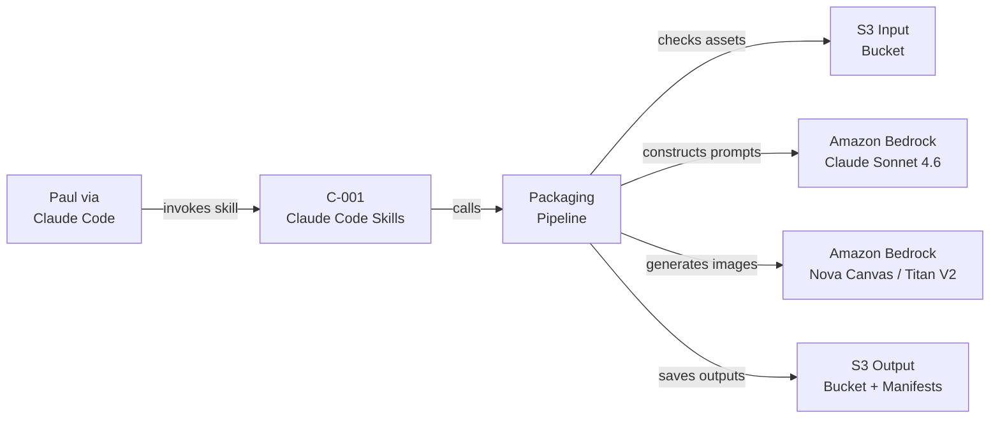
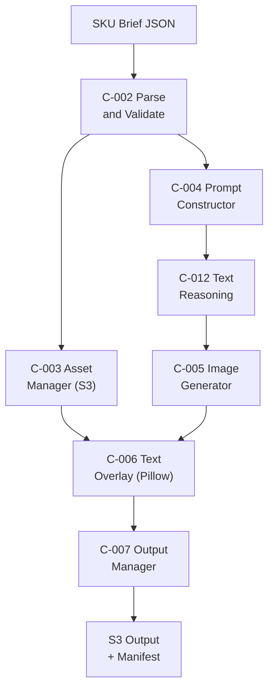
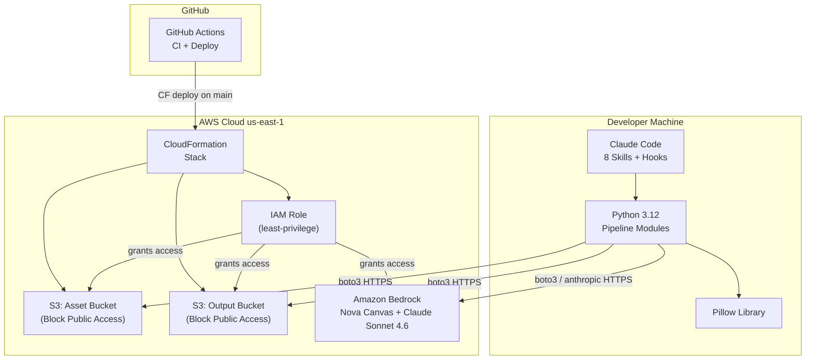

# Technical Architecture Brief (Pre-Implementation)
## PAI Take-Home Exercise — Product Packaging Variant Generator

> **Note:** This is the pre-implementation architecture brief (v2.0, 2026-03-18), written before coding began. It captures the planned architecture, estimates, and risk assessment. For the actual post-implementation architecture reflecting what was built, see [`docs/solution-architecture.md`](../../docs/solution-architecture.md). Key differences: WA scores improved from 6.8→8.0, actual cost was ~$2.21 (vs. ~$5 estimated), brand profiling uses Sonnet 4.6 tool_use (vs. planned Opus 4.6 raw JSON).

**Prepared for**: Adobe PAI Interview Panel (Senior Engineers + Hiring Manager)
**Engagement**: PAI Packaging Automation PoC
**Scope**: Proof of Concept — AI-Native Development Pipeline with AWS Bedrock
**Deliverable Type**: Technical Architecture Brief (pre-implementation plan)
**Version**: 2.0 (2026-03-18)

---

## 1. Engagement Overview

This document captures the architecture decisions, technology choices, and implementation approach behind the PAI Product Packaging Variant Generator PoC. It supports the code walkthrough portion of the interview and provides the panel with clear design rationale before and during the live demo.

**What was built**: An AI-native packaging automation pipeline, controlled entirely via Claude Code custom skills, that accepts a structured SKU brief (JSON) and produces multi-aspect-ratio packaging images using AWS Bedrock GenAI, organized in S3 by SKU/Region/format. GitHub Actions provides automated testing, linting, and deployment on every push.

**AI Suitability Assessment**: HIGH (9/10). GenAI image generation from structured prompts is a proven pattern — structured JSON input, repeatable generation task, clear error tolerance with human review gates. The primary risk is output fidelity at PoC scale, not technical feasibility.

**AI-Assisted Development**: The implementation agent (Claude Code + Sonnet) wrote all code, tests, and documentation. Paul's role was architectural decision-making, IAM policy setup, and approval gates. This approach demonstrates the same AI tooling philosophy the pipeline itself embodies.

---

## 2. Business Objectives

The scenario models a global CPG manufacturer generating hundreds of regional packaging variants monthly. Five measurable goals drive this PoC:

| Goal | How This PoC Demonstrates It |
|------|------------------------------|
| Accelerate time-to-market | Single pipeline run generates 6–12 variants in under 60 seconds |
| Ensure brand consistency | Prompt templates encode brand voice and attribute standards per SKU |
| Maximize local relevance | Region and audience fields in SKU brief drive culturally adapted prompts |
| Optimize packaging ROI | GenAI generation at $0.04–0.12/variant vs. hours of manual agency work |
| Enable design insights | Flat JSON manifest per run captures model, duration, and generation metadata |

**PoC Success Criteria** (from requirements.json v2.0):
- Pipeline accepts SKU brief JSON → produces images in 3 aspect ratios (1:1, 9:16, 16:9)
- At least 2 distinct products/flavors per run
- S3 output organized by `{SKU}/{Region}/{format}/`
- README covers how-to-run, example I/O, design decisions, and assumptions
- AWS resources deployed via CloudFormation
- GitHub Actions CI/CD passes on main (lint + tests + dependency audit)
- Claude Code skills provide all interface operations (8 skills)

---

## 3. Technical Architecture

### 3.1 Architecture Pattern

**Simple GenAI Pipeline with AI-Native Interface** — the simplest pattern that delivers the requirement. No orchestration framework, no agent loops, no RAG. Direct boto3/anthropic API calls throughout. Claude Code custom skills replace all CLI/argparse interaction.

```
SKU Brief JSON → Claude Code /run-pipeline skill
    → Parse & Validate → Check S3 Assets → Construct Prompts
    → [Text Reasoning via Claude Sonnet 4.6]
    → Generate via Bedrock (Nova Canvas) → Text Overlay via Pillow
    → Upload to S3 → Write Manifest
```

### 3.2 Technology Stack

| Layer | Choice | Rationale |
|-------|--------|-----------|
| **Interface** | Claude Code CLI (8 custom skills) | Zero UI development time. Skills replace argparse. Auto-lint and test-gate hooks enforce quality. |
| **GenAI Model (primary)** | Amazon Nova Canvas (`amazon.nova-canvas-v1:0`) | TIFA 0.897, ImageReward 1.250 per Amazon Nova Technical Report (arxiv 2506.12103v1). Available in us-east-1. Built-in inpainting/outpainting for future enhancements. Source: aws.amazon.com/nova/pricing/ ($0.04/image) |
| **GenAI Model (dev/fallback)** | Amazon Titan Image Generator V2 | $0.01/image, available in us-east-1. Used for all development iteration (75% cost savings). Source: aws.amazon.com/bedrock/pricing/ |
| **Text Reasoning** | Claude Sonnet 4.6 via `AnthropicBedrock(aws_region='us-east-1')` | `anthropic[bedrock]` package. Cleaner messages API than raw InvokeModel. Same `bedrock:InvokeModel` IAM permission. Used for prompt construction assistance and compliance text generation. |
| **Backend** | Python 3.12 + boto3 | Universal AWS SDK, no framework overhead |
| **Post-processing** | Pillow (PIL) | Sub-second text overlay compositing for all 3 aspect ratios |
| **Storage** | Amazon S3 (2 buckets) | Input assets + organized output; SSE-S3 encryption; S3 Block Public Access enabled |
| **IaC** | AWS CloudFormation (YAML) | Self-contained, no npm/Terraform dependency |
| **CI/CD** | GitHub Actions (ci.yml + deploy.yml) | Lint (ruff) + pytest + pip-audit on every push; CloudFormation deploy on main |
| **Manifests** | Flat JSON (local + S3) | E-006 pipeline run manifest and E-007 skill invocation log. No database for PoC. |
| **AWS MCP** | awslabs.aws-iac-mcp-server (uv) | Natural language CloudFormation via Claude Code sessions |

### 3.3 Component Design

| Component | Technology | Notes |
|-----------|-----------|-------|
| C-001: Claude Code Interface | 8 skills in `.claude/skills/` | `/run-pipeline`, `/pipeline-status`, `/view-results`, `/deploy`, `/teardown`, `/health-check`, `/run-tests`, `/generate-demo` |
| C-002: SKU Brief Parser | jsonschema | Validates against `src/schemas/sku_brief_schema.json` |
| C-003: Asset Manager | boto3 S3 | S3 read/write; output key builder `{SKU}/{region}/{format}/` |
| C-004: Prompt Constructor | f-string templates | Sanitizes all SKU brief fields before interpolation |
| C-005: Image Generator | boto3 Bedrock runtime | Retry/backoff: 3 attempts, 2^n seconds; falls back to lower tier on ThrottlingException; image caching |
| C-006: Text Overlay Engine | Pillow | 3 layouts (1:1, 9:16, 16:9); semi-transparent text strips |
| C-007: Output Manager | boto3 S3 + JSON | Writes E-006 manifest to S3 and `outputs/runs/` |
| C-008: IaC Stack | CloudFormation | S3×2 (Block Public Access), IAM role (least-privilege), Budget alarm |
| C-009: Claude Code Hooks | `.claude/settings.json` | PostToolUse auto-lint; Stop test gate; PreToolUse Bash guard |
| C-010: GitHub Actions | `.github/workflows/` | `ci.yml` (lint+test+pip-audit) + `deploy.yml` (CF update on main) |
| C-011: AWS MCP Servers | `.mcp.json` (uv) | AWS IaC MCP server + AWS Knowledge MCP server |
| C-012: Text Reasoning Engine | `anthropic[bedrock]` | Claude Sonnet 4.6; prompt enhancement; compliance text |

### 3.4 Data Flow

```
[Paul via Claude Code /run-pipeline]
         │
         ▼
[C-001 Claude Code Interface]
         │
         ▼
[C-002 SKU Brief Parser + Schema Validation]
         │
   ┌─────┴──────────────────────┐
   │                            │
[C-003 Asset Manager]    [C-004 Prompt Constructor]
(S3 asset check)         + [C-012 Text Reasoning]
   │                            │
   └──────────────┬─────────────┘
                  │
         [C-005 Image Generator]
           Nova Canvas / Titan V2
           Retry/Backoff + Cache
                  │
         [C-006 Text Overlay Engine]
           Pillow (title, attrs, regulatory)
                  │
         [C-007 Output Manager]
           S3 upload + E-006 Manifest
```

### 3.5 S3 Output Structure

```
{output-bucket}/
  └── {sku_id}/
       └── {region}/
            ├── front_label/    (1:1 — 1024×1024)
            ├── back_label/     (9:16 — 576×1024)
            ├── wraparound/     (16:9 — 1024×576)
            └── manifest.json   (E-006 pipeline run record)
```

### 3.6 Well-Architected Scores (v2.0)

| Pillar | Score | Key Strength | Key Gap |
|--------|-------|--------------|---------|
| Operational Excellence | 6/10 | CI/CD from day one, Claude Code hooks auto-enforce quality, structured JSON manifests | No CloudWatch dashboards, no runbooks, cache has no TTL (PoC scope) |
| Security | 7/10 | IAM least-privilege, SSE-S3, S3 Block Public Access in CloudFormation, pip-audit in CI | No Bedrock invocation logging (F-004), OIDC not default in CI |
| Reliability | 6/10 | Retry/backoff with jitter (3 attempts), model tier fallback, stateless pipeline | No per-call Bedrock timeouts, no RTO/RPO defined, no stage checkpointing |
| Performance Efficiency | 6/10 | Right-sized compute, Bedrock managed inference, image caching | Sequential generation may miss p95 NFR for multi-product runs |
| Cost Optimization | **9/10** | Tiered model pricing (dev: $0.01, final: $0.04), dry-run zero-cost validation, cache eliminates re-generation | No S3 lifecycle policy in CloudFormation template |
| Sustainability | 7/10 | On-demand only, zero idle compute, cache reduces redundant Bedrock calls | us-east-1 lower renewable % than us-west-2 (model availability trade-off) |
| **Overall** | **6.8/10** | Scores from independent parallel WA review — PoC-appropriate gaps documented | Production path to 8.5+ in BACKLOG.md |

> **Note on WA Scores:** Scores reflect independent parallel agent review (6 pillar reviewers), not self-assessment. PoC gaps in observability, parallelism, and operational procedures are appropriate deferrals — they are documented in BACKLOG.md with production implementations defined. The cost optimization pillar (9/10) is a genuine strength of the tiered model strategy.

---

## 4. AI-Native Development Approach

This PoC was designed and implemented using an AI-native development workflow:

**Claude Code as interface (not just tool):** The pipeline's primary interface is 8 Claude Code custom skills. This eliminates UI development time entirely and positions the developer's AI tooling as the deployment surface — the same pattern the target repo would use in production.

**Hooks as quality enforcement:** Claude Code hooks in `.claude/settings.json` auto-lint on every file edit, run the test suite before completing any task, and guard against destructive AWS commands. Quality gates are automated, not manual.

**AI-assisted hours:** All code, tests, and documentation were written by the implementation agent (Claude Code + Sonnet). Paul's role: architectural decisions, IAM policy setup (aws-marketplace:Subscribe for Anthropic auto-enablement), credential configuration, and approval gates at each phase milestone.

**Effective velocity multiplier:** AI-assisted development delivers 3-5× speed improvement over manual for boilerplate components (CloudFormation, pytest fixtures, argparse alternatives). Novel problem-solving (Pillow coordinate tuning, prompt engineering) is approximately equal to manual pace.

This approach demonstrates the same philosophy that makes GenAI packaging automation valuable: humans make judgment calls, AI handles the execution.

---

## 5. Project Scope and Implementation Plan

### 5.1 In Scope (PoC)

- GenAI packaging image generation pipeline (SKU brief JSON → 3 aspect ratios × 2+ products)
- S3 input asset retrieval and reuse
- Text overlay: product name, key attributes, regulatory information (English)
- Claude Code custom skills as interface layer (8 skills)
- Claude Code hooks for automated quality enforcement
- AWS CloudFormation deployment (S3×2, IAM, Budget alarm)
- GitHub Actions CI/CD (lint + test + pip-audit + deploy)
- Flat JSON manifests for pipeline run history (no database)
- Image caching to avoid redundant Bedrock API calls
- `--dry-run` mode for zero-cost pipeline validation
- README with setup, example I/O, design decisions, limitations
- 4+ demo SKU briefs covering distinct product types and regions

### 5.2 Out of Scope (PoC)

- argparse or Click CLI framework (replaced by Claude Code skills)
- PostgreSQL or any relational database (flat JSON + S3 only; database is BACKLOG)
- Production-scale deployment or auto-scaling
- Web application UI or dashboard
- Multi-user authentication or RBAC
- Real regulatory compliance databases (synthesized lookup table used)
- Brand asset library management
- A/B testing or analytics pipeline
- Multi-language localization beyond English
- Fine-tuned models

### 5.3 Six-Phase Delivery Plan (AI-Assisted)

| Phase | Name | Deliverable | Blocking Gate |
|-------|------|-------------|--------------|
| P-001 | Foundation | AWS stack, Claude Code scaffolding, MCP | G-001 |
| P-002 | Core Pipeline | First images in S3 | G-002 (MINIMUM DEMO STATE) |
| P-003 | Output Quality | All 3 ratios, caching, dry-run | G-003 |
| P-004 | CI/CD & Testing | GitHub Actions green | G-004 |
| P-005 | Docs & Demo | README with images, v1.0.0 tag | G-005 |
| P-006 | Enhancements | Brand + regulatory checks (optional) | — |

Full phase plans are documented in `.claude/plans/` — 7 self-contained markdown files executable by an implementation agent in a single work session.

---

## 6. Architecture Decisions and Trade-offs

| Decision | Choice Made | Alternative | Why Not |
|----------|-------------|-------------|---------|
| Interface | Claude Code 8 custom skills | argparse CLI | Zero UI development time; natural language interface; hooks enforce quality automatically |
| Primary GenAI model | Nova Canvas (`amazon.nova-canvas-v1:0`) | SD3.5 Large | SD3.5 Large is only available in us-west-2; Nova Canvas available in us-east-1 (TIFA 0.897, ImageReward 1.250 per arxiv 2506.12103) |
| Text reasoning | `anthropic[bedrock]` package | raw `boto3.client("bedrock-runtime")` | Cleaner messages API; same IAM permissions; `aws_region='us-east-1'` must be explicit |
| Region | us-east-1 | us-west-2 | Nova Canvas + Claude Sonnet 4.6 both available in us-east-1; no cross-region inference needed |
| CI/CD | GitHub Actions (must-have) | No CI/CD | Demonstrates production engineering maturity; pip-audit closes supply chain finding; SHA pinning closes T-015 |
| Manifests | Flat JSON (S3 + local) | PostgreSQL on RDS | PoC scope: 10-100 runs per session; flat JSON sufficient; database is BACKLOG Phase 2 |
| IaC | CloudFormation | AWS CDK / Terraform | Self-contained YAML; no npm or Terraform binary; 3 resources don't justify CDK complexity |
| Compute | Local execution | Lambda-only | CLI is simpler to demo; Lambda wrapper is natural production extension |
| Text overlay | Pillow | Server-side rendering | Sub-second, no extra service, portable across execution environments |

---

## 7. Team and Roles

**Interview Context**: Solo AI-assisted development session (~10-12 AI-assisted hours).

**Human action time** (Paul, not in AI-assisted hour count):
- IAM policy setup for `pai-exercise` user: verify `aws-marketplace:Subscribe` included for Anthropic Claude Sonnet 4.6 auto-enablement (~5 min, one-time)
- `aws configure --profile pai-exercise` setup (~5 min)
- GitHub authentication and repo creation (~5 min)
- Phase approval gates: visual image inspection at G-002/G-003, CI/CD review at G-004

**Professional Engagement Context** (if productionized):

| Role | Level | Allocation | Responsibilities |
|------|-------|------------|-----------------|
| Solutions Architect / Engineer | Senior | 100% | All pipeline components, IaC, CI/CD, testing, documentation |
| DevOps Engineer (future) | Mid | 25% | Lambda packaging, CloudWatch monitoring, production scaling |

---

## 8. Implementation Schedule

**Total AI-assisted hours**: ~9.5h (PERT baseline 9.83h, with 25% buffer: 12.3h ceiling)

**Complexity**: 4/10 (Medium) — Bedrock image APIs + Claude Code scaffolding + GitHub Actions OIDC setup are newer patterns; Pillow overlay needs coordinate tuning; Bedrock models auto-enable on first invocation; Anthropic Claude Sonnet 4.6 requires `aws-marketplace:Subscribe` in IAM.

**Confidence**: MEDIUM (±40%) — post-full-SA estimate, AI-assisted development reduces variance for boilerplate but not for novel problem-solving.

**Milestones**:
- **M-001** AWS environment ready: CloudFormation deployed, Bedrock accessible (G-001)
- **M-002** First image generated: MINIMUM DEMO STATE (G-002)
- **M-003** All 3 ratios working: Full exercise requirements met (G-003)
- **M-004** CI/CD passing: GitHub Actions green on main (G-004)
- **M-005** PoC complete: README published, v1.0.0 tagged, demo-ready (G-005)

---

## 9. Investment Summary

| Category | Cost | Notes |
|----------|------|-------|
| AWS infrastructure | **~$0.12/year** | S3 storage for ~100MB outputs at $0.023/GB. CloudFormation free. Source: aws.amazon.com/s3/pricing/ |
| GenAI API — Titan dev runs (10 runs) | **~$1.20** | 10 runs × 12 images × $0.01 (Titan V2). Source: aws.amazon.com/bedrock/pricing/ |
| GenAI API — Nova Canvas final runs (5 runs) | **~$2.40** | 5 runs × 12 images × $0.04 (Nova Canvas). Source: aws.amazon.com/nova/pricing/ |
| GenAI API — Demo data generation (4 briefs) | **~$0.96** | 4 briefs × 24 images × $0.04 (Nova Canvas final tier) |
| Claude Sonnet 4.6 text reasoning | **~$0.08** | ~25 runs × 1K tokens × $3/MTok input. Source: aws.amazon.com/bedrock/pricing/ |
| **Total PoC expected cost** | **~$5** | Budget unconstrained — optimize for quality, not cost minimization |

**Budget is unconstrained for this PoC.** The $5 total is the expected real cost, not a constraint. AWS Budget alarm in CloudFormation at $25/$50 provides early warning.

**Production scaling context**: At 100 variants/month, GenAI generation at $0.04–0.12/variant delivers ~99%+ cost reduction vs. manual agency time at $50–100/hr per variant — pending production validation.

---

## 10. Delivery Format

**GitHub delivery**: `github.com/praeducer/pai-take-home-exercise` (public), tagged `v1.0.0`

**Demo format**: 20-30 minute live session
1. Architecture overview via README (5 min)
2. Code walkthrough: `run_pipeline.py`, Claude Code skills, CloudFormation (5 min)
3. Live `/run-pipeline` execution in Claude Code (5 min)
4. S3 output review via `/view-results` (3 min)
5. GitHub Actions CI/CD green checkmarks (2 min)
6. Q&A (remaining time)

---

## 11. Assumptions, Risks, and Constraints

### Assumptions

- AWS account `[ACCOUNT_ID]` is available for this exercise
- Amazon Bedrock model access granted for: `amazon.nova-canvas-v1:0`, `amazon.titan-image-generator-v2:0`, `anthropic.claude-sonnet-4-6` in `us-east-1`
- SKU brief JSON schema defined by the developer (not provided by interviewer)
- Brand assets for PoC can be synthetic/placeholder images
- Regulatory overlay text is synthesized (not from a real compliance database) — documented honestly
- Interview panel evaluates technical approach and architecture decisions — not pixel-perfect packaging output

### Key Risks

| Risk | Likelihood | Impact | Mitigation |
|------|------------|--------|-----------|
| Claude Sonnet 4.6 aws-marketplace:Subscribe missing from IAM | Low | Medium | Full IAM policy in `docs/aws-setup.md`; Amazon models auto-enable on first invocation |
| Pillow text overlay calibration time | Medium | Low | Timebox per ratio to 20 min; ship functional (not pixel-perfect) overlay |
| GitHub Actions OIDC IAM setup | Medium | Low | Use GitHub Secrets fallback (simpler for PoC) |
| Prompt quality iteration overruns | Low | Low | Set one structured template upfront; iterate after pipeline is end-to-end |

### Security Posture (from security_review.json v2.0 — WA Security 7/10)

**Resolved in architecture v2.0:**
- F-001: S3 Block Public Access now in CloudFormation (RESOLVED)
- F-002: AWS CLI named profiles documented as required credential approach (RESOLVED)
- F-003: pip-audit in GitHub Actions ci.yml (RESOLVED)

**Remaining open items** (documented, PoC-acceptable):
- F-010: GitHub Actions action SHA pinning (Phase 4 implementation item)
- F-004: CloudTrail not enabled (PoC acceptable — production must-have)
- F-007: AWS Budget alarm added to CloudFormation (closes at P-001)

---

## 12. Appendix: Architecture Diagrams

### System Context



### Data Flow



### Deployment View



---

## 13. Plan-of-Plans Reference

The full implementation plan is documented in `.claude/plans/` — 7 self-contained markdown files:

- `00-master-plan.md` — global acceptance criteria, phase dependency graph, human action list
- `phase-01-foundation.md` through `phase-06-enhancements.md` — executable phase plans

Each phase plan contains: Prerequisites Checklist, Architecture Decisions, numbered Tasks with acceptance criteria, Automated Verification commands, Human Gate, and Exit Protocol with context snapshot instructions.

The plan-of-plans is designed to be loaded by an implementation agent (Claude Code) and executed phase-by-phase with human approval at each gate.

---

*Assembled by SA Agent (solutions-architecture-agent v1.1.0) from knowledge base artifacts: requirements.json v2.0, architecture.json v2.0, data_model.json v2.0, security_review.json v2.0, estimate.json v2.0, project_plan.json v2.0*

*Human review required before use. SA owns the output — AI assists.*
